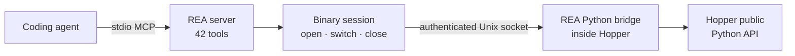

<div align="center">

**English** · [简体中文](README_zh.md) · [日本語](README_ja.md) · [한국어](README_ko.md) · [العربية](README_ar.md)

# REA: Reverse Engineer Anything

### One CLI and MCP server for coding agents to reverse engineer anything

**See a feature you like. Understand how it works. Build it your way.**

[](https://www.npmjs.com/package/@morluto/rea)
[](https://github.com/morluto/rea/actions/workflows/ci.yml)
[](#the-42-tool-workbench)
[](https://nodejs.org/)
[](LICENSE)

[Quick start](#quick-start) · [See the workflow](#one-prompt-a-full-investigation) · [From binary to behavior](#from-binary-to-behavior) · [42 tools](#the-42-tool-workbench) · [How it works](#how-it-works) · [FAQ](#faq)

<br />

<code>npx -y @morluto/rea setup --yes</code>

</div>

---

See a feature in an app that you want in your own product? Give the app to your coding agent—even without its source code. With REA, the agent can investigate the feature, understand how it works, and build a version adapted to your stack, design, and requirements.

REA makes that possible through one CLI and MCP server. Your agent can recover pseudocode, trace behavior across functions, inspect strings and types, and carry the evidence directly into its normal coding workflow. REA handles the reverse-engineering toolchain, analysis session, and target lifecycle behind one interface.

## From binary to behavior

<table>
<tr>
<td width="33%" valign="top">
<strong>Decompile</strong><br /><br />
Open a native app or executable and recover procedures, pseudocode, assembly, strings, symbols, segments, and metadata.
</td>
<td width="33%" valign="top">
<strong>Understand</strong><br /><br />
Follow callers, callees, cross-references, and call graphs until the agent can explain how a feature or algorithm actually works.
</td>
<td width="33%" valign="top">
<strong>Recreate</strong><br /><br />
Turn what the agent learned into a feature for your own product, adapted to your stack, interface, and requirements.
</td>
</tr>
</table>

REA keeps the investigation grounded in binary evidence. It does not claim to recover original source code or automatically clone an application.

## Why REA

|                          |                                                                                                          |
| ------------------------ | -------------------------------------------------------------------------------------------------------- |
| **Built for agents**     | Ask what a compiled app does and let your agent gather evidence instead of guessing.                     |
| **CLI and MCP**          | Run the same reverse-engineering capabilities from your terminal or coding agent.                        |
| **Complexity handled**   | REA sets up the tools, opens the app, keeps the investigation running, and cleans up afterward.          |
| **From insight to code** | Understand a feature, then use the evidence to build your own implementation in the same coding session. |
| **Local by design**      | Analysis runs on your Mac. REA does not upload the binary to a hosted analysis service.                  |
| **Keeps context**        | Investigate several binaries without starting the analysis over for every question.                      |

## Quick start

### Requirements

- macOS 12 or newer
- Node.js 22 or newer
- [Hopper Disassembler](https://www.hopperapp.com/)

REA does not bundle Hopper. Setup can install Homebrew when absent, install the `hopper-disassembler` cask, configure detected Claude Desktop and Cursor MCP clients, and install the REA agent skill. Existing client configuration is backed up, updated atomically, and read back before setup reports success.

Hopper is the separate macOS analysis engine REA controls behind the scenes. Most users interact with REA through the CLI or their agent, but Hopper must be installed and licensed.

### 1. Set up REA

```bash
npx -y @morluto/rea setup --yes
```

### 2. Check the integration

```bash
npx -y @morluto/rea doctor
```

### 3. Start the MCP server

```bash
npx -y @morluto/rea mcp
```

The MCP command speaks stdio, so it waits silently for a connected client. If setup detected your client, restart that client and use the registered `rea` server instead of running the command by hand.

Then ask your agent:

```text
Open /path/to/MyApp, summarize the binary, find the authentication flow,
decompile the relevant procedures, and show the evidence behind your conclusion.
```

## One prompt, a full investigation

```text
Open MyApp, find how its offline search feature works, explain the control flow,
and build a version for my project using TypeScript and SQLite.
```

REA gives the agent a grounded path from that request to working code:

| Step | What the agent does                     | REA tools                                                        |
| ---: | --------------------------------------- | ---------------------------------------------------------------- |
|    1 | Opens and identifies the binary         | `open_binary`, `binary_overview`                                 |
|    2 | Finds likely offline-search clues       | `search_strings`, `search_procedures`, `list_names`              |
|    3 | Connects those clues to executable code | `find_xrefs_to_name`, `xrefs`, `procedure_callers`               |
|    4 | Reconstructs the relevant control flow  | `get_call_graph`, `procedure_callees`, `procedure_info`          |
|    5 | Recovers the implementation             | `procedure_pseudo_code`, `procedure_assembly`, `batch_decompile` |
|    6 | Builds the feature in your project      | code adapted to your stack, product, and requirements            |

REA handles the binary-analysis work in steps 1–5. The agent performs step 6 with its normal file-editing and test tools, keeping the recreated behavior tied to evidence from the binary.

## What agents can do

- Investigate a feature you like and build a version tailored to your own product.
- Explain how a feature works when its source code is unavailable.
- Reconstruct an app's authentication, storage, update, or networking flow.
- Recover enough structure to document an undocumented format or interface.
- Trace a suspicious behavior from a string or symbol to the code that implements it.
- Compare implementation paths across two app versions by switching targets in one session.
- Turn recovered behavior into product features, tests, migration notes, ports, or interoperable replacements.
- Analyze Swift and Objective-C metadata without manually untangling every mangled symbol.
- Leave names, comments, and bookmarks in Hopper so human and agent analysis reinforce each other.

## The 42-tool workbench

| Tool family       | Count | Examples                                                                                               |
| ----------------- | ----: | ------------------------------------------------------------------------------------------------------ |
| Binary inspection |    31 | procedures, pseudocode, assembly, strings, names, segments, callers, callees, xrefs, annotations       |
| Composed analysis |     8 | `binary_overview`, `batch_decompile`, `get_call_graph`, `find_xrefs_to_name`, Swift and ObjC discovery |
| Binary session    |     3 | `open_binary`, `binary_session`, `close_binary`                                                        |

The public inventory is contract-tested and verified through an isolated packaged MCP client. Real-Hopper verification separately checks the same 42-tool surface against two binaries.

## MCP workflow

1. Call `open_binary` with a readable local binary or `.hop` path.
2. Start with `binary_overview`, then narrow the investigation with strings, symbols, decompilation, callers, callees, and xrefs.
3. Call `open_binary` again to switch targets. If the new target fails, REA attempts to reopen the previous target.
4. Call `close_binary` when finished. `binary_session` reports the current state at any time.

Relative paths resolve from the MCP server's working directory. REA detects Mach-O/FAT, ELF, PE, and Hopper databases automatically. FAT binaries select the host-compatible architecture without presenting Hopper's common architecture picker.

### Manual MCP configuration

```json
{
  "mcpServers": {
    "rea": {
      "command": "npx",
      "args": ["-y", "@morluto/rea", "mcp"]
    }
  }
}
```

## How it works



The CLI and MCP adapter call the same binary-session and analysis runtime directly; neither invokes the other. One-shot commands acquire and close their resources for each operation. MCP mode keeps one session alive across calls and target switches.

## CLI

Use the package without installing it globally:

```bash
npx -y @morluto/rea --help
npx -y @morluto/rea doctor --target /path/to/binary
npx -y @morluto/rea analyze /path/to/binary
npx -y @morluto/rea decompile /path/to/binary 0x100003f20
```

Or install the `rea` command globally:

```bash
npm install --global @morluto/rea
rea --help
rea mcp
```

## Configuration

| Variable                  | Purpose                                                                               |
| ------------------------- | ------------------------------------------------------------------------------------- |
| `HOPPER_TARGET_PATH`      | Optional initial binary or `.hop` target. Target-free MCP sessions use `open_binary`. |
| `HOPPER_LAUNCHER_PATH`    | Override the Hopper launcher path.                                                    |
| `HOPPER_TARGET_KIND`      | Select `executable` or `database` for an initial target.                              |
| `HOPPER_LOADER_ARGS_JSON` | Override REA's derived Hopper loader arguments with a JSON array of strings.          |

## Hopper application behavior

REA starts Hopper when needed; Hopper does not need to be running first. Hopper's launcher internally activates the application, so opening a target may bring Hopper to the foreground. REA asks macOS to start Hopper hidden and in the background when possible, but cannot guarantee that it will remain behind the current application.

REA derives explicit format and architecture arguments to prevent common FAT and ARM selection dialogs. Other Hopper or macOS dialogs may still require a person. REA reports timeouts and remediation through CLI or MCP results instead of attempting to answer UI prompts.

Closing a REA session shuts down its bridge and removes its private socket directory. It does not quit a Hopper application the user may be using.

## Security model

Each bridge session has a random capability token and a Unix socket restricted to the current user. Protocol messages are bounded, and caller-visible errors omit launcher stderr and internal exception causes.

This boundary rejects unauthenticated connections and other local user accounts, but it is not a sandbox and does not defend against a malicious process already running as the same user. Opening an untrusted binary delegates parsing and analysis to Hopper with the current macOS user's permissions. Report vulnerabilities through the private process in [SECURITY.md](SECURITY.md).

## FAQ

<details>
<summary><strong>Does Hopper need to be running before I start REA?</strong></summary>

No. REA starts Hopper when an operation needs it. An already-running Hopper application is also supported.

</details>

<details>
<summary><strong>Why did Hopper appear in front of my other windows?</strong></summary>

Hopper's launcher internally activates the application. REA requests background startup, but macOS and Hopper may still bring a window or dialog forward. See [Hopper application behavior](#hopper-application-behavior).

</details>

<details>
<summary><strong>Does REA include Hopper?</strong></summary>

No. Hopper is separately installed and licensed software. REA supplies the CLI, MCP server, session management, analysis workflows, and authenticated bridge that make Hopper usable by agents.

</details>

<details>
<summary><strong>Does REA upload my binary?</strong></summary>

REA has no hosted analysis service. It passes local operations to Hopper through a current-user Unix socket. Your coding agent or model provider may have its own data policy, so review that separately.

</details>

<details>
<summary><strong>Can REA recover the original source code?</strong></summary>

No decompiler can guarantee the original source. REA gives an agent pseudocode, assembly, symbols, strings, metadata, and relationships that it can use to explain or compatibly recreate observed behavior.

</details>

<details>
<summary><strong>Which agents can use REA?</strong></summary>

Any client that can launch a stdio MCP server can use the manual configuration. Setup currently detects and configures Claude Desktop and Cursor automatically.

</details>

## Development

```bash
npm ci
npm run check
npm run verify:package
npm pack --dry-run
```

Real-Hopper verification requires two distinct binaries:

```bash
HOPPER_TARGET_PATH=/path/to/target-a \
HOPPER_SECOND_TARGET_PATH=/path/to/distinct-target-b \
npm run verify:hopper
```

See [CONTRIBUTING.md](CONTRIBUTING.md) for architecture guidelines, pull-request expectations, and the maintainer release checklist. Generated API documentation is available under [`docs/api`](docs/api/index.html).

## Project links

[npm](https://www.npmjs.com/package/@morluto/rea) · [Issues](https://github.com/morluto/rea/issues) · [Security](SECURITY.md) · [Contributing](CONTRIBUTING.md) · [Hopper](https://www.hopperapp.com/)

## License

[MIT](LICENSE)
