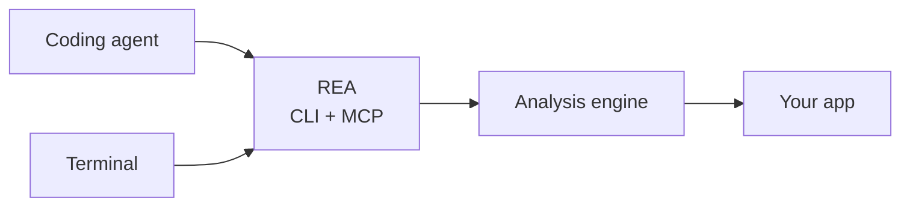

<div align="center">

**English** · [简体中文](README_zh.md) · [日本語](README_ja.md) · [한국어](README_ko.md) · [العربية](README_ar.md)

# REA: Reverse Engineer Anything

### One CLI and MCP server for coding agents to reverse engineer anything

**See a feature you like. Understand how it works. Build it your way.**

[](https://www.npmjs.com/package/@morluto/rea)
[](https://github.com/morluto/rea/actions/workflows/ci.yml)
[](#43-tools-for-deeper-investigation)
[](https://nodejs.org/)
[](LICENSE)

[Quick start](#quick-start) · [See the workflow](#one-prompt-a-full-investigation) · [From app to feature](#from-app-to-feature) · [43 tools](#43-tools-for-deeper-investigation) · [How it works](#how-it-works) · [FAQ](#faq)

<br />

<code>npx skills add morluto/rea</code>

</div>

---

See a feature in an app that you want in your own product? Give the app to your coding agent—even without its source code. With REA, the agent can investigate the feature, understand how it works, and build a version adapted to your stack, design, and requirements.

REA makes that possible through one CLI and MCP server. Your agent can inspect the compiled app, follow how features work, and use what it learns in its normal coding workflow. REA handles the reverse-engineering tools behind one interface.

## Just ask your agent

Install the REA skill:

```bash
npx skills add morluto/rea
```

Then ask:

```text
Set up REA and reverse engineer the Notes app. Explain how search works,
show me how you know, and build a similar feature for my project.
```

Notes is only an example. Name any app you want to understand, or ask the agent to start with an overview.

## From app to feature

<table>
<tr>
<td width="33%" valign="top">
<strong>Decompile</strong><br /><br />
Open an app and recover readable code, strings, names, and other clues about how it works.
</td>
<td width="33%" valign="top">
<strong>Understand</strong><br /><br />
Follow the code from one part of the app to another until the agent can explain how a feature actually works.
</td>
<td width="33%" valign="top">
<strong>Recreate</strong><br /><br />
Turn what the agent learned into a feature for your own product, adapted to your stack, interface, and requirements.
</td>
</tr>
</table>

REA shows how it reached its conclusions. It does not claim to recover original source code or automatically clone an application.

## Why REA

|                          |                                                                                      |
| ------------------------ | ------------------------------------------------------------------------------------ |
| **Built for agents**     | Ask what an app does and let your agent inspect it instead of guessing.              |
| **CLI and MCP**          | Run the same reverse-engineering capabilities from your terminal or coding agent.    |
| **Complexity handled**   | REA installs and manages the reverse-engineering tools behind the scenes.            |
| **From insight to code** | Understand a feature, then build your own version in the same coding session.        |
| **Local by design**      | Analysis runs on your Mac. REA does not upload the app to a hosted analysis service. |
| **Keeps context**        | Investigate several apps without starting over for every question.                   |

## Quick start

### With a coding agent — recommended

```bash
npx skills add morluto/rea
```

Ask your agent to set up REA. It will check your Mac, explain anything it needs to install, ask for approval, and guide you through system prompts. After setup, restart the agent if it asks you to load the full REA toolset.

### From Terminal

```bash
npx -y @morluto/rea setup --yes
```

If macOS or an installer asks for confirmation, complete the prompt and run the same command again. Restart a configured coding agent so it loads REA.

### What setup handles

- macOS 12 or newer
- Node.js 22 or newer

You do not need to install the reverse-engineering tools manually. Setup installs Homebrew and [Hopper](https://www.hopperapp.com/) when needed, configures detected Claude Desktop and Cursor installations, and installs the REA skill. Hopper is separate software and requires its own license; setup installs it but does not provide a license.

If something is not working, run:

```bash
npx -y @morluto/rea doctor
```

### CLI or coding agent?

| If you want to…                                           | Use                                        |
| --------------------------------------------------------- | ------------------------------------------ |
| Ask an agent to investigate an app and build a feature    | Install the skill, then talk to your agent |
| Inspect or decompile one part of an app from the Terminal | `rea analyze` or `rea decompile`           |

## One prompt, a full investigation

```text
Reverse engineer the Notes app. Find how offline search works, explain it,
and build a version for my project using TypeScript and SQLite.
```

REA gives the agent a clear path from that request to working code:

| Step | What the agent does                     | REA tools                                                        |
| ---: | --------------------------------------- | ---------------------------------------------------------------- |
|    1 | Opens and identifies the binary         | `open_binary`, `binary_overview`                                 |
|    2 | Finds likely offline-search clues       | `search_strings`, `search_procedures`, `list_names`              |
|    3 | Connects those clues to executable code | `find_xrefs_to_name`, `xrefs`, `procedure_callers`               |
|    4 | Reconstructs the relevant control flow  | `get_call_graph`, `procedure_callees`, `procedure_info`          |
|    5 | Decompiles the relevant routines        | `procedure_pseudo_code`, `procedure_assembly`, `batch_decompile` |
|    6 | Builds the feature in your project      | code adapted to your stack, product, and requirements            |

REA handles the app analysis in steps 1–5. The agent performs step 6 with its normal file-editing and test tools, using what it learned about the app.

## What agents can do

- Investigate a feature you like and build a version tailored to your own product.
- Explain how a feature works when its source code is unavailable.
- Reconstruct an app's authentication, storage, update, or networking flow.
- Recover enough structure to document an undocumented format or interface.
- Trace a suspicious behavior from a string or symbol to the code that implements it.
- Compare implementation paths across two app versions by switching targets in one session.
- Turn recovered behavior into product features, tests, migration notes, ports, or interoperable replacements.
- Analyze Swift and Objective-C metadata without manually untangling every mangled symbol.
- Leave names, comments, and bookmarks in Hopper so human and agent analysis reinforce each other.

## 43 tools for deeper investigation

| Tool family       | Count | Examples                                                                                                                   |
| ----------------- | ----: | -------------------------------------------------------------------------------------------------------------------------- |
| Binary inspection |    31 | procedures, pseudocode, assembly, strings, names, segments, callers, callees, xrefs, annotations                           |
| Composed analysis |     9 | `binary_overview`, `analyze_function`, `batch_decompile`, `get_call_graph`, `find_xrefs_to_name`, Swift and ObjC discovery |
| Binary session    |     3 | `open_binary`, `binary_session`, `close_binary`                                                                            |

## Using REA with other coding agents

Setup currently configures Claude Desktop and Cursor automatically. Any coding agent that supports local MCP servers can use REA with the configuration below.

### Manual MCP configuration

```json
{
  "mcpServers": {
    "rea": {
      "command": "npx",
      "args": ["-y", "@morluto/rea", "mcp"]
    }
  }
}
```

## How it works



The CLI and MCP server use the same analysis engine. Terminal commands close the app when they finish; an agent session keeps it open while the investigation continues.

## CLI

The agent workflow above is the easiest way to use REA. For a one-off overview from the Terminal:

```bash
npx -y @morluto/rea analyze /Applications/Notes.app
```

Run `npx -y @morluto/rea --help` for direct decompilation and other options.

Or install the `rea` command globally:

```bash
npm install --global @morluto/rea
rea --help
rea mcp
```

REA accepts a Mac `.app` folder directly. If an agent cannot find an app by name, tell it where the app is installed.

## Hopper application behavior

REA starts Hopper when needed; Hopper does not need to be running first. Hopper's launcher internally activates the application, so opening a target may bring Hopper to the foreground. REA asks macOS to start Hopper hidden and in the background when possible, but cannot guarantee that it will remain behind the current application.

REA derives explicit format and architecture arguments to prevent common FAT and ARM selection dialogs. Other Hopper or macOS dialogs may still require a person. REA reports timeouts and remediation through CLI or MCP results instead of attempting to answer UI prompts.

Closing a REA session shuts down its bridge and removes its private socket directory. It does not quit a Hopper application the user may be using.

## Security model

REA communicates with Hopper over a private local connection and does not provide a hosted analysis service. This is not a sandbox: Hopper opens apps with your current macOS permissions. Report vulnerabilities through the private process in [SECURITY.md](SECURITY.md).

## FAQ

<details>
<summary><strong>Does Hopper need to be running before I start REA?</strong></summary>

No. REA starts Hopper when an operation needs it. An already-running Hopper application is also supported.

</details>

<details>
<summary><strong>Why did Hopper appear in front of my other windows?</strong></summary>

Hopper's launcher internally activates the application. REA requests background startup, but macOS and Hopper may still bring a window or dialog forward. See [Hopper application behavior](#hopper-application-behavior).

</details>

<details>
<summary><strong>Does REA include Hopper?</strong></summary>

No. Setup can install Hopper for you, but Hopper remains separate software with its own license. REA supplies the CLI, MCP server, and workflows that make it usable by agents.

</details>

<details>
<summary><strong>Does REA upload the app?</strong></summary>

REA has no hosted analysis service. It passes local operations to Hopper through a current-user Unix socket. Your coding agent or model provider may have its own data policy, so review that separately.

</details>

<details>
<summary><strong>Can REA recover the original source code?</strong></summary>

No decompiler can guarantee the original source. REA gives an agent pseudocode, assembly, symbols, strings, metadata, and relationships that it can use to explain or compatibly recreate observed behavior.

</details>

<details>
<summary><strong>Which agents can use REA?</strong></summary>

Any coding agent that can run a local MCP server can use the manual configuration. Setup currently detects and configures Claude Desktop and Cursor automatically.

</details>

## Development

See [CONTRIBUTING.md](CONTRIBUTING.md) for setup, architecture, tests, and release instructions. Generated API documentation is available under [`docs/api`](docs/api/index.html).

## Project links

[npm](https://www.npmjs.com/package/@morluto/rea) · [Issues](https://github.com/morluto/rea/issues) · [Security](SECURITY.md) · [Contributing](CONTRIBUTING.md) · [Hopper](https://www.hopperapp.com/)

## License

[MIT](LICENSE)
