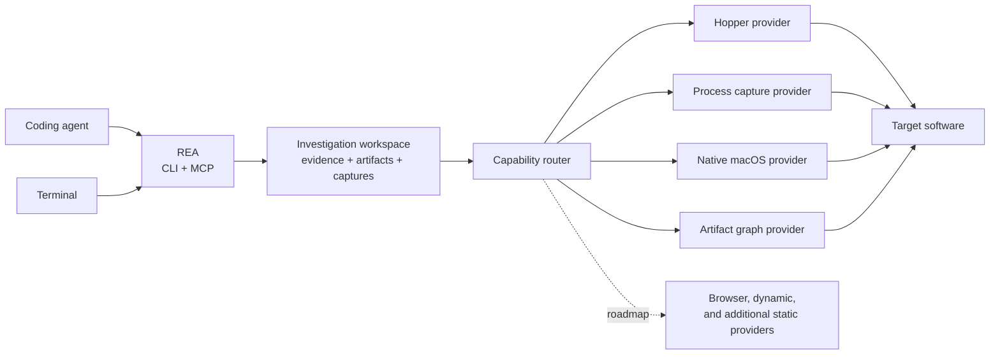

<div align="center">

**English** · [简体中文](README_zh.md) · [日本語](README_ja.md) · [한국어](README_ko.md) · [العربية](README_ar.md)

# REA: Reverse Engineer Anything

### One CLI and MCP server for coding agents to reverse engineer anything

**See a feature you like. Understand how it works, down to the binary level.**

[](https://www.npmjs.com/package/rea-agents)
[](https://github.com/morluto/rea/actions/workflows/ci.yml)
[](#68-tools-for-investigation)
[](https://nodejs.org/)
[](LICENSE)

[Quick start](#quick-start) · [Current status](#current-status) · [Investigation model](#the-investigation-model) · [68 tools](#68-tools-for-investigation) · [Roadmap](#roadmap) · [How it works](#how-it-works)

<br />

<code>npm install --global rea-agents && rea setup</code>

</div>

---

See a feature in an app that you want in your own product? Give the app to your coding agent—even without its source code. With REA, the agent can investigate the feature, explain how it works, show its evidence, and build a version adapted to your stack and requirements.

REA gives agents one consistent way to investigate software. Today that includes deep native analysis through Hopper, complete function dossiers, reproducible Evidence v2 records, and controlled process capture. The longer-term toolkit extends the same agent workflow to packaged apps, JavaScript bundles, websites, APIs, protocols, mobile artifacts, firmware, runtime behavior, and differences between versions.

Reverse engineering normally makes the operator choose a tool, learn its API, move evidence between programs, and decide what to inspect next. REA gives that work to the agent through commands, skills, structured results, and repeatable investigation workflows.

## Just ask your agent

Install the REA skill:

```bash
npx skills add morluto/rea
```

Then ask:

```text
Use REA to understand how search works in the Notes app, show me the
evidence, and build a similar feature for my project.
```

Notes is only an example. Name any app you want to understand, or ask the agent to start with an overview.

## The investigation model

<table>
<tr>
<td width="33%" valign="top">
<strong>Decompile</strong><br /><br />
Open an app and recover readable code, strings, names, and other clues about how it works.
</td>
<td width="33%" valign="top">
<strong>Understand</strong><br /><br />
Follow the code from one part of the app to another until the agent can explain how a feature actually works.
</td>
<td width="33%" valign="top">
<strong>Recreate</strong><br /><br />
Turn what the agent learned into a feature for your own product, adapted to your stack, interface, and requirements.
</td>
</tr>
</table>

REA shows how it reached its conclusions. It does not claim to recover original source code or automatically clone an application.

## Why REA

|                          |                                                                                      |
| ------------------------ | ------------------------------------------------------------------------------------ |
| **Built for agents**     | Ask what an app does and let your agent inspect it instead of guessing.              |
| **CLI and MCP**          | Run the same reverse-engineering capabilities from your terminal or coding agent.    |
| **Complexity handled**   | REA installs and manages the reverse-engineering tools behind the scenes.            |
| **From insight to code** | Understand a feature, then build your own version in the same coding session.        |
| **Local by design**      | Analysis runs on your Mac. REA does not upload the app to a hosted analysis service. |
| **Keeps context**        | Investigate several apps without starting over for every question.                   |

## Quick start

### Install the CLI — recommended

```bash
npm install --global rea-agents
rea setup
```

Installing the CLI does not update Homebrew, Node.js, npm, Hopper, or coding-agent configuration. `rea setup` detects what is already present, prints every proposed change, and asks before applying it.

REA detects Claude Code, Claude Desktop, Codex, Cursor, Gemini CLI, Windsurf, and Devin. Registrations are additive, backup-first, and read back after writing. You can safely rerun setup.

An optional curl wrapper installs the same CLI package and starts setup only when a terminal is available:

```bash
curl -fsSL https://raw.githubusercontent.com/morluto/rea/main/install.sh | bash
```

Pass installer options after `bash -s --`, for example `--dry-run`, `--no-setup`, or `--version 1.0.0`. The curl wrapper never installs prerequisites or configures integrations itself. See [Installation and setup](docs/installation.md) for its exact mutation boundary.

### With a coding agent — recommended

```bash
npx skills add morluto/rea
```

Ask your agent to set up REA. It will check your Mac, explain anything it needs to install, ask for approval, and guide you through system prompts. After setup, restart the agent if it asks you to load the full REA toolset.

Review the setup plan, approve it if appropriate, complete Hopper's one-time activation when prompted, then describe the app or feature you want to understand.

### From Terminal — no installation

```bash
npx -y rea-agents setup
npx -y rea-agents doctor
npx -y rea-agents analyze /Applications/Notes.app
```

Review the setup plan before confirming it. Restart a configured coding agent so it loads REA.

### From Terminal — install the `rea` command

```bash
npm install --global rea-agents
rea setup
rea doctor
rea analyze /Applications/Notes.app
```

Update that global installation in place:

```bash
rea upgrade
```

REA checks npm for the latest release and verifies that the running package is
the global installation it will replace. Source, local, and `npx` copies report
the manual `npm install --global rea-agents@latest` command instead of updating
an unrelated global package.

Choose either the no-install commands or the global installation. You do not need both.

### Requirements

- macOS 12 or newer
- Ubuntu 24.04+, Fedora 41+, or 64-bit Arch Linux
- Node.js 22.19+ or 24.11+ (including newer releases)
- npm; REA does not require or install a particular npm version

Deep binary analysis currently uses [Hopper](https://www.hopperapp.com/), a separate desktop application with its own license. Setup reuses an existing installation. If Hopper is missing, interactive setup proposes the official package and includes it in the confirmation plan. Unattended installation requires `rea setup --yes --install-hopper`.

If something is not working, run:

```bash
npx -y rea-agents doctor
```

`rea doctor --json` is read-only and distinguishes unsupported hosts, missing dependencies, a missing local analysis engine, configuration drift, and healthy checks. Fresh-install activation is reported by setup because Hopper does not expose a reliable noninteractive activation probe.

### Linux installation and troubleshooting

On macOS, approved setup downloads Hopper's official DMG, verifies it, and installs the app into `~/Applications` without Homebrew or administrator privileges. It opens Hopper once for activation; no manual drag-and-drop is required.

On Ubuntu 24.04+, Fedora 41+, and 64-bit Arch Linux, approved setup downloads the matching official Hopper package, restricts downloads to Hopper's public origin, verifies the published size and checksum, and invokes `apt-get`, `dnf`, or `pacman`. When REA is not already running as root, `pkexec` presents the system authorization prompt. REA never invokes `sudo`.

The normal Linux launcher is `/opt/hopper/bin/Hopper`. If Hopper was installed elsewhere:

```bash
export HOPPER_LAUNCHER_PATH=/absolute/path/to/Hopper
rea doctor --json
```

If doctor reports a missing analysis engine even though the file exists, inspect shared-library resolution with:

```bash
ldd /opt/hopper/bin/Hopper | grep 'not found'
```

Install the missing distribution packages and rerun `rea setup`. Hopper is a desktop application: real analysis requires an active `DISPLAY` or `WAYLAND_DISPLAY`, plus one-time license activation. The curl installer places the `rea` command in `~/.local/bin` on Linux; add that directory to future shell `PATH` values if it is not already present.

REA defaults `HOPPER_LAUNCHER_PATH` to `/Applications/Hopper Disassembler.app/Contents/MacOS/hopper` on macOS and `/opt/hopper/bin/Hopper` on Linux. Explicit configuration always takes precedence.

To remove only REA-owned MCP registrations and the managed skill:

```bash
rea uninstall
rea uninstall --purge-data # also removes only ~/.rea/cache and ~/.rea/state
```

Uninstall preserves Hopper, Node.js, evidence, captures, external evidence roots, unrelated skills, and other MCP servers. It refuses malformed client configuration and never follows purge-data symlinks.

### CLI or coding agent?

| If you want to…                                           | Use                                                            |
| --------------------------------------------------------- | -------------------------------------------------------------- |
| Ask an agent to investigate an app and build a feature    | Install the skill, then talk to your agent                     |
| Inspect or decompile one part of an app from the Terminal | `rea analyze` or `rea decompile`                               |
| Validate, canonicalize, or compare Evidence v2 bundles    | `rea evidence-import`, `rea evidence-export`, or `rea compare` |
| Run or resume a persistent two-version artifact analysis  | `rea investigate-versions`                                     |
| Import source as historical reference                     | `rea import-reference-source`                                  |
| Capture or compare controlled process behavior            | `rea capture-process` or `rea compare-process-captures`        |

Filesystem evidence commands and MCP file tools are disabled until the operator approves absolute roots:

```bash
export REA_EVIDENCE_ROOTS_JSON='["/absolute/path/to/evidence"]'
rea evidence-import /absolute/path/to/evidence/bundle.json
rea evidence-export /absolute/path/to/evidence/bundle.json /absolute/path/to/evidence/canonical.json
rea compare /absolute/path/to/evidence/left.json /absolute/path/to/evidence/right.json
rea investigate-versions /path/to/v1 /path/to/v2 /absolute/path/to/evidence/releases.json --yes --workspace-name releases
```

`investigate-versions` inventories both versions, checkpoints their observed
Evidence, derives an artifact comparison, and records a changed-behavior report.
The workspace uses deterministic content identities and monotonic CAS-linked
revisions, so the same request resumes an interrupted run or reuses a completed
run without replacing earlier investigations. It currently compares static
artifact structure only; it does not execute either version, and its report
keeps every difference labeled as a behavior candidate. See
[Persistent investigation workspaces](docs/investigation-workspaces.md).

Historical source import requires a separate allowlist and never treats source as current behavioral authority:

```bash
export REA_REFERENCE_ROOTS_JSON='["/absolute/path/to/source"]'
rea import-reference-source /absolute/path/to/source
```

Exports never replace an existing file unless `--overwrite` is explicit. Imports are size/depth bounded, validate every Evidence v2 ID and manifest, and never execute bundle content.

## One prompt, a full investigation

```text
Reverse engineer the Notes app. Find how offline search works, explain it,
and build a version for my project using TypeScript and SQLite.
```

REA gives the agent a clear path from that request to working code:

| Step | What the agent does                     | REA tools                                                        |
| ---: | --------------------------------------- | ---------------------------------------------------------------- |
|    1 | Opens and identifies the binary         | `open_binary`, `binary_overview`                                 |
|    2 | Finds likely offline-search clues       | `search_strings`, `search_procedures`, `list_names`              |
|    3 | Connects those clues to executable code | `find_xrefs_to_name`, `xrefs`, `procedure_callers`               |
|    4 | Reconstructs the relevant control flow  | `get_call_graph`, `procedure_callees`, `procedure_info`          |
|    5 | Decompiles the relevant routines        | `procedure_pseudo_code`, `procedure_assembly`, `batch_decompile` |
|    6 | Builds the feature in your project      | code adapted to your stack, product, and requirements            |

REA handles the app analysis in steps 1–5. The agent performs step 6 with its normal file-editing and test tools, using what it learned about the app.

## What agents can do

- Investigate a feature you like and build a version tailored to your own product.
- Explain how a feature works when its source code is unavailable.
- Reconstruct an app's authentication, storage, update, or networking flow.
- Recover enough structure to document an undocumented format or interface.
- Trace a suspicious behavior from a string or symbol to the code that implements it.
- Run, checkpoint, resume, and reuse a content-addressed artifact investigation across two versions.
- Turn recovered behavior into product features, tests, migration notes, ports, or interoperable replacements.
- Analyze Swift and Objective-C metadata without manually untangling every mangled symbol.
- Leave names, comments, and bookmarks in Hopper so human and agent analysis reinforce each other.

## 68 tools for investigation

| Tool family               | Count | Examples                                                                                                                |
| ------------------------- | ----: | ----------------------------------------------------------------------------------------------------------------------- |
| Native inspection         |    33 | procedures, pseudocode, assembly, strings, names, segments, callers, callees, xrefs, annotations                        |
| Investigation workflows   |    10 | `binary_overview`, `analyze_function`, `batch_decompile`, `trace_feature`, call graphs, Swift and Objective-C discovery |
| Native macOS utilities    |     5 | Mach-O metadata, code signatures, plists, architectures, Swift demangling; Hopper-free and provenance-bearing           |
| Artifact graph            |     2 | deterministic directory, ZIP/APK/IPA, and ASAR inventory; explicitly selected extraction into an absent owned tree      |
| Workspace and observation |    18 | target lifecycle, Evidence v2 bundles, process/artifact/function comparison, evidence-linked residual-unknown lifecycle |

The public interface describes what the agent is trying to learn. Providers decide how to answer. macOS utilities handle common semantic inspection without launching Hopper; Hopper handles deeper native analysis; the process harness implements controlled behavioral capture.

## Current status

REA is already useful for native application investigation on macOS:

- Open Mach-O, ELF, PE, `.app`, ZIP, APK, IPA, ASAR, plist, JavaScript, source-map, and Hopper database targets.
- Traverse content-addressed artifact graphs without extraction; on macOS, read-only DMG traversal additionally requires `native_mount_approved: true` and `REA_ARTIFACT_NATIVE_MOUNT_ENABLED=true`. Materialize only approved occurrences into absent output roots.
- Build bounded function dossiers with pseudocode, assembly, CFG edges, comments, calls, references, strings, and names.
- Search and trace features across symbols, strings, metadata, references, and call paths.
- Record every successful result as deterministic Evidence v2 with artifact and provider identity, confidence, authority, limitations, and locations.
- Export and import evidence bundles across sessions.
- Persist automatic cross-version artifact runs as canonical, lock-protected workspaces with tamper-evident revision commitments.
- Capture approved PTY scenarios as Process Capture v4 Evidence, including committed run manifests, raw and rendered terminal frames, scripted interactions, descendant settlement, named filesystem checkpoints, deterministic command shims, and loopback HTTP/WebSocket exchanges.
- Compare complete artifact inventories by stable path, content, metadata, and relations; incomplete evidence never implies equivalence.
- Compare explicit function dossiers across text, calls, references, strings, and address-normalized CFG topology with per-facet unknowns.
- Compare canonical Evidence bundles by exact membership, explicit observation pairs, and residual-unknown histories without turning omissions into behavioral absence.
- Aggregate runtime comparisons into observed behavior changes while keeping static artifact/function differences labeled as candidates.
- Build bounded, Evidence-cited direct call paths by exact address without treating missing dossiers as graph leaves.
- Correlate exact static/runtime findings through explicit hypotheses without claiming causality from cochange.
- Verify finite behavioral and structural reconstruction specifications with pass, fail, and unknown kept distinct.
- Track residual unknowns through immutable CAS revisions, evidence-qualified resolution, contradictions, probes, and validated dependency relationships.
- With explicit `unknown_registry_approved: true`, record bounded trace/capture residuals, typed provider unavailability, and capture disagreements automatically.

Hopper is the first provider, not the boundary of the project. Some current workflows still require Hopper and macOS; every evidence record identifies the provider and limitations behind its result.

## Roadmap

REA is growing into a toolkit for understanding software across static artifacts and observed behavior. The next capability families are:

1. **Artifact decomposition** — DMG, ASAR, ZIP, packages, universal-binary slices, application resources, embedded frameworks, mobile packages, and artifact graphs.
2. **Web and Electron investigation** — Playwright/CDP capture of DOM, accessibility trees, screenshots, storage, console, IPC, HTTP, WebSocket, routes, and visual or structural differences.
3. **Deterministic behavior harnesses** — stronger process-tree ownership, protocol fixtures, network policy, filesystem tracing, signals, reconnects, and cross-version comparison.
4. **JavaScript and source recovery** — bundle indexing, AST/module reconstruction, source-map discovery, historical-source matching, and CodeDB-backed cross-references.
5. **Runtime observation** — approval-gated LLDB, Frida, system logs, process and filesystem observers, and native API tracing.
6. **More static-analysis providers** — native platform utilities first, followed by Ghidra, IDA/Hex-Rays, Binary Ninja, Rizin, LIEF, and other engines behind provider-neutral capabilities.
7. **More targets and platforms** — Windows-native providers and ConPTY verification, Linux parity, websites and APIs, mobile artifacts, firmware, document formats, and other software-defined systems.
8. **Differential reconstruction expansion** — add automatic function matching, protocol/UI comparison, controlled replay, residual-unknown planning, and reconstruction verification to persistent version runs.

Roadmap items describe direction, not shipped support. New providers must produce the same evidence and safety metadata as existing capabilities before they become part of the public workflow. Once REA has multiple optional toolchains, setup can become capability-selective; the consent rules for that future work are recorded in the [installation roadmap](docs/roadmap.md).

See the [static-analysis provider evaluation](docs/provider-evaluation.md) for the current research matrix and admission gate.

## Using REA with other coding agents

Setup currently configures Claude Desktop and Cursor automatically. Any coding agent that supports local MCP servers can use REA with the configuration below.

### Manual MCP configuration

```json
{
  "mcpServers": {
    "rea": {
      "command": "npx",
      "args": ["-y", "rea-agents", "mcp"]
    }
  }
}
```

## How it works



The CLI and MCP server use the same application workflows and evidence contracts. A provider declares which capabilities it supports and the side effects those capabilities may have. Terminal commands are short-lived; an MCP session can retain an active target and evidence ledger across an investigation. Approved persistent workspaces keep canonical Evidence and resumable run checkpoints across both process and session lifetimes.

## CLI

The agent workflow above is the easiest way to use REA. For a one-off overview from the Terminal:

```bash
npx -y rea-agents analyze /Applications/Notes.app
npx -y rea-agents inspect /Applications/Notes.app
npx -y rea-agents inspect /Applications/Notes.app --detail detailed --limit 20
npx -y rea-agents search /Applications/Notes.app "offline"
npx -y rea-agents function /Applications/Notes.app 0x1000
npx -y rea-agents xrefs /Applications/Notes.app 0x1000
npx -y rea-agents trace /Applications/Notes.app "offline"
npx -y rea-agents compare /absolute/path/to/left-evidence.json /absolute/path/to/right-evidence.json
npx -y rea-agents investigate-versions /path/to/v1 /path/to/v2 /absolute/path/to/evidence/releases.json --yes
npx -y rea-agents capabilities
npx -y rea-agents providers
```

Run `npx -y rea-agents --help` for direct decompilation, bounded search and
other options. `analyze` and `inspect` share the same overview workflow;
`function`, `xrefs`, and `trace` return the same Evidence v2 envelopes as MCP.

Or install the `rea` command globally:

```bash
npm install --global rea-agents
rea --help
rea upgrade
rea mcp
```

REA accepts a Mac `.app` folder directly. If an agent cannot find an app by name, tell it where the app is installed.

## Current Hopper provider

REA starts Hopper when needed; Hopper does not need to be running first. Hopper's launcher internally activates the application, so opening a target may bring Hopper to the foreground. REA asks macOS to start Hopper hidden and in the background when possible, but cannot guarantee that it will remain behind the current application.

REA derives explicit format and architecture arguments to prevent common FAT and ARM selection dialogs. Other Hopper or macOS dialogs may still require a person. REA reports timeouts and remediation through CLI or MCP results instead of attempting to answer UI prompts.

Closing a REA session shuts down its bridge and removes its private socket directory. It does not quit a Hopper application the user may be using.

## Advanced process-capture setup

Process capture is disabled by default. Enabling it requires
`REA_PROCESS_CAPTURE_ENABLED=true`, approved executable and working roots in
`REA_PROCESS_EXECUTABLE_ROOTS_JSON` and `REA_PROCESS_WORKING_ROOTS_JSON`, and an
environment allowlist in `REA_PROCESS_ALLOWED_ENV_JSON`. Because the current PTY
adapter uses host networking, it also requires
`REA_PROCESS_ALLOW_EXTERNAL_NETWORK=true`.

Capture a scenario or compare two saved Process Capture v4 Evidence records:

```bash
rea capture-process ./scenario.json > authority.json
rea capture-process ./reconstruction.json > reconstruction.json
rea compare-process-captures authority.json reconstruction.json
```

The comparison reports each observed dimension separately and identifies the
first terminal, interaction, exit, filesystem, protocol, process, or shim
divergence. See [Process Capture v4](docs/process-capture.md) for scenario
fields, command-shim replay, checkpoint triggers, limits, and safety behavior.

If the native PTY backend is unavailable, install Xcode command-line tools and
run `npm run rebuild:native`. Linux source builds require Python, `make`, and a
C++ toolchain. Compatible packaged binaries do not require this rebuild.

ASAR inventory verifies Electron integrity metadata for both archive entries
and `.asar.unpacked` companion files. Integrity failures identify the logical
path, declared and calculated SHA-256 values, and whether the entry was
unpacked; REA does not silently accept the mismatched artifact.

## Security model

REA does not provide a hosted analysis service. Hopper communication uses an authenticated private local socket. Dynamic capabilities are disabled by default and require both operator policy and explicit per-call approval. REA is not a security sandbox: providers and launched targets run with the current user's permissions, and each capability reports its side effects and limitations. Report vulnerabilities through the private process in [SECURITY.md](SECURITY.md).

## FAQ

<details>
<summary><strong>Does Hopper need to be running before I start REA?</strong></summary>

No. REA starts Hopper when an operation needs it. An already-running Hopper application is also supported.

</details>

<details>
<summary><strong>Why did Hopper appear in front of my other windows?</strong></summary>

Hopper's launcher internally activates the application. REA requests background startup, but macOS and Hopper may still bring a window or dialog forward. See [Hopper application behavior](#hopper-application-behavior).

</details>

<details>
<summary><strong>Does REA include Hopper?</strong></summary>

No. Setup can install Hopper for you, but Hopper remains separate software with its own license. REA supplies the CLI, MCP server, and workflows that make it usable by agents.

</details>

<details>
<summary><strong>Does REA upload the app?</strong></summary>

REA has no hosted analysis service. Current providers analyze artifacts and capture behavior locally. Your coding agent or model provider may have its own data policy, so review that separately.

</details>

<details>
<summary><strong>Can REA recover the original source code?</strong></summary>

No decompiler can guarantee the original source. REA gives an agent pseudocode, assembly, symbols, strings, metadata, and relationships that it can use to explain or compatibly recreate observed behavior.

</details>

<details>
<summary><strong>Which agents can use REA?</strong></summary>

Any coding agent that can run a local MCP server can use the manual configuration. Setup currently detects and configures Claude Desktop and Cursor automatically.

</details>

## Development

See [CONTRIBUTING.md](CONTRIBUTING.md) for setup, architecture, tests, and release instructions. Generated API documentation is available under [`docs/api`](docs/api/index.html).

## Project links

[npm](https://www.npmjs.com/package/rea-agents) · [Issues](https://github.com/morluto/rea/issues) · [Security](SECURITY.md) · [Contributing](CONTRIBUTING.md) · [Hopper](https://www.hopperapp.com/)

## License

[MIT](LICENSE)
