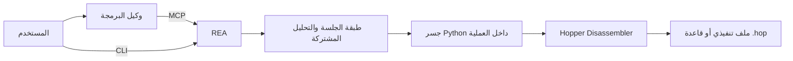

<div align="center">

[English](README.md) · [简体中文](README_zh.md) · [日本語](README_ja.md) · [한국어](README_ko.md) · **العربية**

# REA: هندسة أي شيء عكسيًا

### واجهة CLI وخادم MCP واحدان يمكّنان وكلاء البرمجة من إجراء هندسة عكسية لأي شيء

**اعثر على ميزة تعجبك. افهم آلية عملها. ابنها بالطريقة التي تريدها.**

[](https://www.npmjs.com/package/@morluto/rea)
[](https://github.com/morluto/rea/actions/workflows/ci.yml)
[](#منصة-من-42-أداة)
[](https://nodejs.org/)
[](LICENSE)

[البدء السريع](#البدء-السريع) · [من الملف التنفيذي إلى السلوك](#من-الملف-التنفيذي-إلى-السلوك) · [42 أداة](#منصة-من-42-أداة) · [كيف يعمل](#كيف-يعمل) · [الأسئلة الشائعة](#الأسئلة-الشائعة)

<br />

<code>npx -y @morluto/rea setup --yes</code>

</div>

هل وجدت في تطبيق ما ميزة تريدها في منتجك؟ أعط التطبيق إلى وكيل البرمجة حتى من دون شيفرته المصدرية. باستخدام REA، يستطيع الوكيل استقصاء الميزة وفهم آلية عملها ثم بناء نسخة ملائمة لتقنياتك وتصميمك ومتطلباتك.

يوفر REA هذه العملية عبر CLI وخادم MCP واحدين. يستطيع الوكيل استعادة الشيفرة شبه المصدرية، وتتبع السلوك بين الدوال، وفحص السلاسل والأنواع، ثم استخدام الأدلة مباشرة في عمله البرمجي المعتاد. ويجمع REA سلسلة أدوات الهندسة العكسية وجلسة التحليل ودورة حياة الهدف خلف واجهة واحدة.

## من الملف التنفيذي إلى السلوك

| فك الترجمة                                                        | الفهم                                                     | إعادة الإنشاء                                                 |
| ----------------------------------------------------------------- | --------------------------------------------------------- | ------------------------------------------------------------- |
| استخرج الشيفرة شبه المصدرية، والتعليمات، والسلاسل النصية، والرموز | تتبع تدفق التحكم والمراجع المتبادلة والاستدعاءات والأنواع | حوّل ما تعلمه الوكيل إلى ميزة تناسب تقنياتك وواجهتك ومتطلباتك |

يربط REA الاستقصاء بأدلة من الملف التنفيذي. وهو لا يدّعي استعادة الشيفرة المصدرية الأصلية أو استنساخ التطبيق تلقائيًا.

## لماذا REA؟

|                      |                                                                                           |
| -------------------- | ----------------------------------------------------------------------------------------- |
| **مصمم للوكلاء**     | اسأل عما يفعله تطبيق مترجم ودع الوكيل يجمع الأدلة بدلًا من التخمين.                       |
| **CLI وMCP**         | استخدم قدرات الهندسة العكسية نفسها من الطرفية أو وكيل البرمجة.                            |
| **يتولى التعقيد**    | يدير REA إعداد الأدوات وفتح التطبيق واستمرار الاستقصاء والتنظيف بعد الانتهاء.             |
| **سير عمل كامل**     | انتقل من النظرة الأولى إلى الشيفرة شبه المصدرية وعلاقات الاستدعاء والأنواع وأدلة التنفيذ. |
| **محلي حسب التصميم** | يجري التحليل على جهاز Mac ولا يرفع REA الملف التنفيذي إلى خدمة تحليل مستضافة.             |
| **يحافظ على السياق** | استقصِ عدة ملفات تنفيذية من دون بدء التحليل من جديد عند كل سؤال.                          |

## البدء السريع

### 1. المتطلبات

- macOS 12 أو أحدث
- Node.js 22 أو أحدث
- [Hopper Disassembler](https://www.hopperapp.com/) مثبتًا ومرخصًا

لا تتضمن حزمة REA برنامج Hopper. يستطيع الإعداد تثبيت Homebrew عند غيابه، وتثبيت حزمة `hopper-disassembler`، وتهيئة عملاء Claude Desktop وCursor المكتشفين، وتثبيت مهارة وكيل REA. تُنسخ إعدادات العملاء الحالية احتياطيًا، ثم تُحدّث ذريًا وتُقرأ مرة أخرى قبل الإبلاغ عن النجاح.

### 2. إعداد وكلائك

```bash
npx -y @morluto/rea setup --yes
```

يكتشف هذا الأمر عملاء الوكلاء المدعومين ويسجل خادم MCP باستخدام أمر عائم:

```text
npx -y @morluto/rea mcp
```

### 3. تحقق من البيئة

```bash
npx -y @morluto/rea doctor
```

### 4. حلّل ملفًا تنفيذيًا

```bash
npx -y @morluto/rea analyze /path/to/app
npx -y @morluto/rea decompile /path/to/app 0x100003f20
```

أو شغّل خادم MCP مباشرة:

```bash
npx -y @morluto/rea mcp
```

## استقصاء كامل بطلب واحد

بعد الإعداد، يمكنك أن تطلب من وكيلك:

> افتح التطبيق، واكتشف آلية عمل البحث من دون اتصال، واشرح تدفق التحكم، ثم ابنِ نسخة لمشروعي باستخدام TypeScript وSQLite.

يمكن للوكيل تحويل ذلك إلى سير عمل قابل للتحقق:

```text
فتح الهدف
  → انتظار اكتمال تحليل Hopper
  → جرد المعماريات والرموز والسلاسل النصية
  → تحديد نقاط الدخول والدوال المهمة
  → تتبع الاستدعاءات والمراجع المتبادلة وتدفق التحكم
  → فك ترجمة التنفيذ ذي الصلة
  → تلخيص السلوك والقيود والحالات الطرفية
  → بناء الميزة بما يلائم تقنيات المشروع ومتطلباته
```

## ما الذي يمكنك فعله؟

### فهم تطبيق لا تملك مصدره

اكشف نقاط الدخول، وأسماء الفئات، والسلاسل النصية، والأطر المستخدمة، ومسارات الميزات من الملف التنفيذي وحده.

### بناء ميزة تعجبك بطريقتك

استقصِ الميزة، وافهم سلوكها، ثم ابنِ نسخة ملائمة لمنتجك وتقنياتك ومتطلباتك.

### توثيق بروتوكول أو تنسيق غير موثق

تتبع الموزعات، والثوابت، والمقارنات، والقراءة والكتابة لفهم الرسائل وتنسيقات الملفات وآلات الحالات.

### إعادة إنشاء سلوك متوافق

حوّل منطقًا مفكوك الترجمة إلى مواصفات واضحة، ثم نفذ بديلًا نظيفًا تحكمه اختبارات السلوك الملحوظ.

### تدقيق منطق أمني حساس

افحص التحقق من الإدخال، والتشفير، والصلاحيات، والتخزين، ومسارات الأخطاء من دون رفع الملف التنفيذي إلى خدمة بعيدة.

## منصة من 42 أداة

| عائلة الأدوات         | العدد | أمثلة                                                                               |
| --------------------- | ----: | ----------------------------------------------------------------------------------- |
| فحص الملفات التنفيذية |    31 | الدوال، والشيفرة شبه المصدرية، والتعليمات، والسلاسل، والأسماء، والمراجع، والتعليقات |
| التحليل المركب        |     8 | النظرة العامة، وفك الترجمة الدفعي، ومخططات الاستدعاء، والمراجع، واكتشاف الأنواع     |
| جلسة الملف التنفيذي   |     3 | `open_binary` و`binary_session` و`close_binary`                                     |

تُختبر قائمة الأدوات العامة بعقود آلية وعميل MCP معزول من الحزمة. ويتحقق الاختبار باستخدام محرك التحليل الفعلي من واجهة الأدوات الـ42 نفسها على ملفين تنفيذيين.

## استخدام REA مع وكيل MCP

يسجل `rea setup` تكوينًا مكافئًا لما يلي:

```json
{
  "mcpServers": {
    "rea": {
      "command": "npx",
      "args": ["-y", "@morluto/rea", "mcp"]
    }
  }
}
```

يمكنك أيضًا تشغيل وضع MCP مباشرة:

```bash
rea mcp
rea --mcp
```

كلا الأمرين يشغل خادم stdio نفسه. تبقى جلسة Hopper حية بين طلبات الأدوات، ويمكن للوكيل تبديل الأهداف من دون إعادة بناء الخادم.

## كيف يعمل؟



لا يستدعي محول CLI خادم MCP، ولا يستدعي خادم MCP واجهة CLI. كلاهما يعتمد مباشرة على طبقة التشغيل المشتركة نفسها.

## أوامر CLI

```text
rea setup [--yes]                         تسجيل REA لدى عملاء الوكلاء
rea doctor                                فحص Node.js وHopper وتكوين العملاء
rea analyze <target>                      تحليل ملف تنفيذي أو قاعدة Hopper
rea decompile <target> <address>          فك ترجمة دالة عند عنوان محدد
rea mcp                                   تشغيل خادم MCP عبر stdio
rea mcp add                               إضافة تسجيلات MCP
rea mcp doctor                            تشخيص تسجيلات MCP
rea --mcp                                 اسم بديل متوافق لوضع MCP
```

اعرض جميع الخيارات باستخدام:

```bash
npx -y @morluto/rea --help
```

## سلوك Hopper

يستطيع REA تشغيل Hopper تلقائيًا؛ لا حاجة إلى افتراض أنه يعمل مسبقًا. لكنه تطبيق macOS رسومي، لذلك قد يطلب التركيز أو يعرض حوارًا عندما يفرض Hopper قرارًا تفاعليًا. لا يمكن لـ REA ضمان تشغيل غير مرئي تمامًا لأن هذه الواجهة يملكها Hopper وmacOS.

لتجنب مربع اختيار معمارية ملف شامل، حدد معطيات المحمل مسبقًا:

```bash
export HOPPER_LOADER_ARGS_JSON='["-l", "Mach-O", "--aarch64"]'
```

يدير REA دورة حياة Hopper ويحاول إغلاق العمليات التي بدأها عند انتهاء الأمر أو جلسة MCP.

## الأمان والخصوصية

- يبقى تحليل الملف التنفيذي محليًا بين REA وHopper.
- لا يرفع REA الأهداف إلى خدمة مستضافة.
- راجع الملفات التنفيذية غير الموثوقة واعزلها كما تفعل مع أي مدخل أصلي قد يكون ضارًا.
- أبلغ عن الثغرات وفق [سياسة الأمان](SECURITY.md)، وليس عبر قضية عامة.

## الأسئلة الشائعة

<details>
<summary><strong>هل يتضمن REA محرك فك ترجمة خاصًا به؟</strong></summary>

لا. يوفر REA طبقة الوكيل وواجهة CLI وإدارة الجلسات وسير العمل، بينما يوفر Hopper محرك التحليل وفك الترجمة.

</details>

<details>
<summary><strong>هل يجب أن يكون Hopper مفتوحًا مسبقًا؟</strong></summary>

لا. يستطيع REA تشغيله. لكن Hopper قد يصبح مرئيًا أو يطلب إدخالًا عند الحاجة إلى قرار تفاعلي.

</details>

<details>
<summary><strong>هل يعمل REA على Linux أو Windows؟</strong></summary>

ليس حاليًا. يعتمد المحول الحالي على تطبيق Hopper لنظام macOS وواجهة Python الخاصة به.

</details>

<details>
<summary><strong>هل يمكنني تحليل قواعد Hopper المحفوظة؟</strong></summary>

نعم. يدعم وقت التشغيل الملفات التنفيذية وقواعد `.hop`.

</details>

## التطوير

```bash
git clone https://github.com/morluto/rea.git
cd rea
npm ci
npm run check
```

يتطلب التحقق الحقيقي من Hopper تثبيتًا محليًا وملفات اختبار مناسبة:

```bash
npm run verify:hopper
```

راجع [CONTRIBUTING.md](CONTRIBUTING.md) لإرشادات التطوير والإصدار.

## المشروع

- [حزمة npm](https://www.npmjs.com/package/@morluto/rea)
- [GitHub](https://github.com/morluto/rea)
- [القضايا والطلبات](https://github.com/morluto/rea/issues)
- [Hopper Disassembler](https://www.hopperapp.com/)
- [سياسة الأمان](SECURITY.md)

## الترخيص

[MIT](LICENSE)
