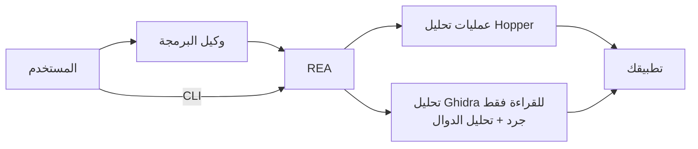

<div align="center">

[English](README.md) · [简体中文](README_zh.md) · [日本語](README_ja.md) · [한국어](README_ko.md) · **العربية**

# REA: هندسة أي شيء عكسيًا

### واجهة CLI وخادم MCP واحدان يمكّنان وكلاء البرمجة من إجراء هندسة عكسية لأي شيء

**اعثر على ميزة تعجبك. افهم آلية عملها. ابنها بالطريقة التي تريدها.**

[](https://www.npmjs.com/package/rea-agents)
[](https://github.com/morluto/rea/actions/workflows/ci.yml)
[](#منصة-أدوات-التحقيق)
[](https://nodejs.org/)
[](LICENSE)

[البدء السريع](#البدء-السريع) · [من الملف التنفيذي إلى السلوك](#من-الملف-التنفيذي-إلى-السلوك) · [دليل الأدوات](#منصة-أدوات-التحقيق) · [كيف يعمل](#كيف-يعمل) · [الأسئلة الشائعة](#الأسئلة-الشائعة)

<br />

<code>curl -fsSL https://raw.githubusercontent.com/morluto/rea/main/install.sh | bash</code>

</div>

هل وجدت في تطبيق ما ميزة تريدها في منتجك؟ أعط التطبيق إلى وكيل البرمجة حتى من دون شيفرته المصدرية. باستخدام REA، يستطيع الوكيل استقصاء الميزة وفهم آلية عملها ثم بناء نسخة ملائمة لتقنياتك وتصميمك ومتطلباتك.

يوفر REA هذه العملية عبر CLI وخادم MCP واحدين. يستطيع الوكيل قراءة شيفرة التطبيق وتتبع طريقة عمل الميزات ثم استخدام الأدلة مباشرة في عمله البرمجي المعتاد. ويتولى REA أدوات الهندسة العكسية المعقدة خلف واجهة واحدة.

## اطلب من وكيلك مباشرة

```bash
npx skills add morluto/rea
```

ثم اطلب:

```text
أعد REA وأجر هندسة عكسية لتطبيق Notes. اشرح طريقة عمل البحث وكيف توصلت إلى ذلك،
ثم ابنِ ميزة مشابهة لمشروعي.
```

تطبيق Notes مجرد مثال. يمكنك تسمية أي تطبيق تريد فهمه أو طلب البدء بنظرة عامة.

## من الملف التنفيذي إلى السلوك

| فك الترجمة                                                        | الفهم                                                     | إعادة الإنشاء                                                 |
| ----------------------------------------------------------------- | --------------------------------------------------------- | ------------------------------------------------------------- |
| استخرج الشيفرة شبه المصدرية، والتعليمات، والسلاسل النصية، والرموز | تتبع تدفق التحكم والمراجع المتبادلة والاستدعاءات والأنواع | حوّل ما تعلمه الوكيل إلى ميزة تناسب تقنياتك وواجهتك ومتطلباتك |

يوضح REA كيف وصل إلى نتائجه. وهو لا يدّعي استعادة الشيفرة المصدرية الأصلية أو استنساخ التطبيق تلقائيًا.

## لماذا REA؟

|                      |                                                                                           |
| -------------------- | ----------------------------------------------------------------------------------------- |
| **مصمم للوكلاء**     | اسأل عما يفعله تطبيق مترجم ودع الوكيل يجمع الأدلة بدلًا من التخمين.                       |
| **CLI وMCP**         | استخدم قدرات الهندسة العكسية نفسها من الطرفية أو وكيل البرمجة.                            |
| **يتولى التعقيد**    | يدير REA إعداد الأدوات وفتح التطبيق واستمرار الاستقصاء والتنظيف بعد الانتهاء.             |
| **سير عمل كامل**     | انتقل من النظرة الأولى إلى الشيفرة شبه المصدرية وعلاقات الاستدعاء والأنواع وأدلة التنفيذ. |
| **محلي حسب التصميم** | يجري التحليل على جهاز Mac ولا يرفع REA الملف التنفيذي إلى خدمة تحليل مستضافة.             |
| **يحافظ على السياق** | استقصِ عدة ملفات تنفيذية من دون بدء التحليل من جديد عند كل سؤال.                          |

## البدء السريع

### باستخدام وكيل برمجة — موصى به

```bash
npx skills add morluto/rea
```

اطلب من الوكيل إعداد REA. سيفحص جهاز Mac ويشرح ما يحتاج إلى تثبيته ويطلب الموافقة ويرشدك خلال رسائل النظام. أعد تشغيل الوكيل بعد الإعداد إذا طلب ذلك لتحميل مجموعة الأدوات الكاملة.

### قبل البدء

- macOS 12 أو أحدث
- Ubuntu 24.04+ أو Fedora 41+ أو Arch Linux ‏64 بت
- Node.js 22.19+ أو 24.11+ وnpm المرفق مع Node

يعرض `rea setup` خطة التغييرات كاملة ويطلب التأكيد قبل تطبيقها. لا يثبت أو يحدّث Homebrew أو Node.js أو npm. إذا كان [Hopper](https://www.hopperapp.com/) مفقودًا، يقترح Setup الحزمة الرسمية. Hopper برنامج منفصل يحتاج إلى ترخيص خاص به.

إذا كان Ghidra 12.1.2 PUBLIC وJDK 21 الكامل بنواة 64 بت مثبتين مسبقًا على Linux ‏64 بت، فيمكن لـ Setup أيضًا تسجيل `GHIDRA_INSTALL_DIR` و`JAVA_HOME` الاختياري بعد الموافقة. لا ينزّل REA أو يثبت أو يعدّل Ghidra أو Java. يوفّر مزوّد Ghidra ضمن جلسة headless معزولة وللقراءة فقط الجرد، وفك الترجمة، والتجميع، وعلاقات الاستدعاء، والمراجع ذات الأنواع، وxref، وCFG، وملفات تحليل الدوال؛ وتبقى حالة الواجهة الرسومية وعمليات التعديل غير متاحة.

#### التثبيت على Linux واستكشاف الأخطاء

على Ubuntu 24.04+ وFedora 41+ وArch Linux ‏64 بت، ينزّل REA حزمة DEB أو RPM أو Arch الرسمية، ويتحقق من الحجم وقيمة التحقق المنشورين، ثم يستخدم `apt-get` أو `dnf` أو `pacman` لحل الاعتماديات. عند التشغيل دون root يعرض `pkexec` طلب تفويض النظام. لا يستدعي REA الأمر `sudo`.

مسار المشغّل الافتراضي هو `/opt/hopper/bin/Hopper`. استخدم `HOPPER_LAUNCHER_PATH` للمسارات الأخرى. إذا أبلغ Doctor عن غياب محرك التحليل، شغّل `ldd /opt/hopper/bin/Hopper | grep 'not found'`، وثبّت المكتبات الناقصة ثم أعد `rea setup`. يشغّل REA إصدار Hopper التجريبي المدعوم على شاشة Xvfb خاصة ويختار وضع التجربة الذي يقدمه Hopper لكل جلسة تحليل؛ لا يلزم `DISPLAY` لسطح المكتب ولا ترخيص مدفوع، مع بقاء حدود الإصدار التجريبي التي يحددها المورّد. أضف `~/.local/bin` إلى `PATH` أيضًا.

### 1. إعداد REA

```bash
curl -fsSL https://raw.githubusercontent.com/morluto/rea/main/install.sh | bash
npx rea-agents setup
```

إذا طلب macOS أو برنامج التثبيت تأكيدًا، فأكمل الخطوة ثم شغّل الأمر نفسه مرة أخرى.

### 2. إعادة تشغيل وكيل البرمجة

يكتشف Setup كلاً من Claude Code وClaude Desktop وCodex وCursor وGemini CLI وWindsurf وDevin. ويهيئ تلقائيًا أول ستة عملاء عند اكتشافهم؛ أما Devin فيُبلّغ عن اكتشافه فقط ولا يُعدّله لعدم وجود حد موثق لإعداد MCP المحلي. أعد تشغيل العملاء الذين جرى إعدادهم كي يحمّلوا REA.

### 3. اطلب من الوكيل

يمكنك ذكر التطبيق باسمه. سيعثر وكيل البرمجة عليه ويمرر ملف البرنامج الذي يحتاجه REA.

```text
استخدم REA لإجراء هندسة عكسية لتطبيق Notes. اشرح طريقة عمل البحث واعرض الأدلة،
ثم ابنِ ميزة مشابهة لمشروعي باستخدام SQLite.
```

إذا واجهت مشكلة، فشغّل:

```bash
npx -y rea-agents@latest doctor
rea uninstall
rea uninstall --purge-data
```

## استقصاء كامل بطلب واحد

بعد الإعداد، يمكنك أن تطلب من وكيلك:

> افتح التطبيق، واكتشف آلية عمل البحث من دون اتصال، واشرح تدفق التحكم، ثم ابنِ نسخة لمشروعي باستخدام TypeScript وSQLite.

يمكن للوكيل تحويل ذلك إلى سير عمل قابل للتحقق:

```text
فتح الهدف
  → انتظار اكتمال تحليل Hopper
  → جرد المعماريات والرموز والسلاسل النصية
  → تحديد نقاط الدخول والدوال المهمة
  → تتبع الاستدعاءات والمراجع المتبادلة وتدفق التحكم
  → فك ترجمة التنفيذ ذي الصلة
  → تلخيص السلوك والقيود والحالات الطرفية
  → بناء الميزة بما يلائم تقنيات المشروع ومتطلباته
```

## ما الذي يمكنك فعله؟

### فهم تطبيق لا تملك مصدره

اكشف نقاط الدخول، وأسماء الفئات، والسلاسل النصية، والأطر المستخدمة، ومسارات الميزات من الملف التنفيذي وحده.

### بناء ميزة تعجبك بطريقتك

استقصِ الميزة، وافهم سلوكها، ثم ابنِ نسخة ملائمة لمنتجك وتقنياتك ومتطلباتك.

### توثيق بروتوكول أو تنسيق غير موثق

تتبع الموزعات، والثوابت، والمقارنات، والقراءة والكتابة لفهم الرسائل وتنسيقات الملفات وآلات الحالات.

### إعادة إنشاء سلوك متوافق

حوّل منطقًا مفكوك الترجمة إلى مواصفات واضحة، ثم نفذ بديلًا نظيفًا تحكمه اختبارات السلوك الملحوظ.

### تدقيق منطق أمني حساس

افحص التحقق من الإدخال، والتشفير، والصلاحيات، والتخزين، ومسارات الأخطاء من دون رفع الملف التنفيذي إلى خدمة بعيدة.

## منصة أدوات التحقيق

| عائلة الأدوات         | العدد | أمثلة                                                                                                                                                                                                          |
| --------------------- | ----: | -------------------------------------------------------------------------------------------------------------------------------------------------------------------------------------------------------------- |
| فحص الملفات التنفيذية |    33 | الدوال، والشيفرة شبه المصدرية، والتعليمات، والسلاسل، والأسماء، والمراجع، والتعليقات                                                                                                                            |
| التحليل المركب        |    10 | النظرة العامة، وفك الترجمة الدفعي، ومخططات الاستدعاء، والمراجع، واكتشاف الأنواع                                                                                                                                |
| أدوات macOS الأصلية   |     5 | بيانات Mach-O والتوقيعات وملفات plist والمعماريات وفك رموز Swift دون تشغيل Hopper                                                                                                                              |
| رسم القطع الأثرية     |     2 | جرد حتمي للدلائل وZIP/APK/IPA وASAR واستخراج معاملاتي محدد صراحة                                                                                                                                               |
| Managed PE/CLI        |     8 | هوية PE/CLI، أعضاء البيانات الوصفية، بصمات CIL، تصريحات P/Invoke/الحدود الأصلية والتحقق منها، إسقاط رسم التطبيق، استيراد إعادة البناء من فك الترجمة، إعادة ربط الرموز، خطط ترابط وقت التشغيل ومقارنة الإصدارات |
| مراقبة المتصفح        |     8 | التقاط CDP محدود الأصل وتحليل الحزم وخرائط المصدر واكتشاف WebMCP والفروق والأدلة المرئية                                                                                                                       |
| تحليل Electron        |     4 | مراقبة سلبية ضمن جذور canonical، ورسم ثابت ومحدود للتطبيق، ومطابقة ثابتة/وقت تشغيل قائمة على Evidence                                                                                                          |
| سير عمل التطبيقات     |     7 | تتبع محدود ومقارنة إصدارات فريدة وإعادة تشغيل وحدات معزولة ومعتمدة على Linux وتوصيف وقت التشغيل المُدار وإغلاق تغطية إعادة البناء                                                                              |
| جلسة الملف التنفيذي   |    18 | فتح الأهداف وحزم الأدلة ومقارنة العمليات والقطع والدوال وسجل المجهولات المتبقية                                                                                                                                |

## استخدام REA مع وكلاء برمجة آخرين

يكتشف Setup كلاً من Claude Code وClaude Desktop وCodex وCursor وGemini CLI وWindsurf وDevin، ويهيئ تلقائيًا أول ستة عملاء. أما Devin فيُبلّغ عن اكتشافه فقط ولا يُعدّله. يمكن لأي وكيل برمجة يدعم خوادم MCP المحلية استخدام REA بالإعداد التالي:

```json
{
  "mcpServers": {
    "rea": {
      "command": "npx",
      "args": ["-y", "rea-agents@latest", "mcp"]
    }
  }
}
```

## كيف يعمل؟



يستخدم CLI وخادم MCP محرك التحليل نفسه. تغلق أوامر الطرفية التطبيق عند انتهائها، بينما تبقيه جلسة الوكيل مفتوحًا أثناء الاستقصاء.

## أوامر CLI

سير عمل الوكيل أعلاه هو أسهل طريقة لاستخدام REA. للحصول على نظرة سريعة على تطبيق من الطرفية:

```bash
npx -y rea-agents@latest analyze /Applications/Notes.app
npx -y rea-agents@latest compare /absolute/path/to/left-evidence.json /absolute/path/to/right-evidence.json
```

شغّل `npx -y rea-agents@latest --help` لمعرفة خيارات فك الترجمة المباشر والخيارات الأخرى.

يمكن لـ REA فتح مجلد `.app` على Mac مباشرة. إذا لم يعثر الوكيل على التطبيق، فأخبره بمكان تثبيته.

## سلوك Hopper

يستطيع REA تشغيل Hopper تلقائيًا؛ لا حاجة إلى افتراض أنه يعمل مسبقًا. لكنه تطبيق macOS رسومي، لذلك قد يطلب التركيز أو يعرض حوارًا عندما يفرض Hopper قرارًا تفاعليًا. لا يمكن لـ REA ضمان تشغيل غير مرئي تمامًا لأن هذه الواجهة يملكها Hopper وmacOS.

لتجنب مربع اختيار معمارية ملف شامل، حدد معطيات المحمل مسبقًا:

```bash
export HOPPER_LOADER_ARGS_JSON='["-l", "Mach-O", "--aarch64"]'
```

يدير REA دورة حياة Hopper ويحاول إغلاق العمليات التي بدأها عند انتهاء الأمر أو جلسة MCP.

## الأمان والخصوصية

- يبقى تحليل الملف التنفيذي محليًا بين REA ومزوّد التحليل المختار.
- لا يرفع REA الأهداف إلى خدمة مستضافة.
- تستخدم جلسات Ghidra مشروعًا مؤقتًا معزولًا ولا تفتح مشاريع Ghidra التي يملكها المستخدم أو تعدّلها.
- راجع الملفات التنفيذية غير الموثوقة واعزلها كما تفعل مع أي مدخل أصلي قد يكون ضارًا.
- أبلغ عن الثغرات وفق [سياسة الأمان](SECURITY.md)، وليس عبر قضية عامة.

## الأسئلة الشائعة

<details>
<summary><strong>هل يتضمن REA محرك فك ترجمة خاصًا به؟</strong></summary>

لا. يستطيع Setup تثبيت Hopper، لكنه يظل برنامجًا منفصلًا بترخيص خاص به. يوفر REA واجهة CLI وخادم MCP وسير العمل المخصص للوكلاء.

</details>

<details>
<summary><strong>هل يجب أن يكون Hopper مفتوحًا مسبقًا؟</strong></summary>

لا. يستطيع REA تشغيله. لكن Hopper قد يصبح مرئيًا أو يطلب إدخالًا عند الحاجة إلى قرار تفاعلي.

</details>

<details>
<summary><strong>هل يعمل REA على Linux أو Windows؟</strong></summary>

نعم، يعمل REA على macOS 12+ وUbuntu 24.04+ وFedora 41+ وArch Linux ‏64 بت؛ Windows غير مدعوم حاليًا. يستخدم التحليل العميق Hopper أو مزوّد Ghidra للقراءة فقط الذي يختاره المستدعي؛ ويتطلب Ghidra على Linux الإصدار 12.1.2 وJDK 21 الكامل.

</details>

<details>
<summary><strong>هل يمكنني تحليل قواعد Hopper المحفوظة؟</strong></summary>

نعم. يدعم وقت التشغيل الملفات التنفيذية وقواعد `.hop`.

</details>

## التطوير

راجع [CONTRIBUTING.md](CONTRIBUTING.md) لإعداد بيئة التطوير وبنية المشروع والاختبارات وإرشادات الإصدار.

## المشروع

- [حزمة npm](https://www.npmjs.com/package/rea-agents)
- [GitHub](https://github.com/morluto/rea)
- [القضايا والطلبات](https://github.com/morluto/rea/issues)
- [Hopper Disassembler](https://www.hopperapp.com/)
- [سياسة الأمان](SECURITY.md)

## الترخيص

[MIT](LICENSE)
