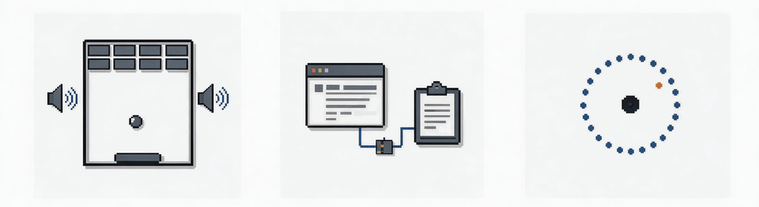

<div align="center">

[English](README.md) · [简体中文](README_zh.md) · [繁體中文](README_zh-TW.md) · [日本語](README_ja.md) · [한국어](README_ko.md) · [Türkçe](README_tr.md) · [Русский](README_ru.md) · [Tiếng Việt](README_vi.md) · [ไทย](README_th.md) · [Deutsch](README_de.md) · [Español](README_es.md) · [Français](README_fr.md) · [Українська](README_uk.md) · [Polski](README_pl.md) · [Português (Brasil)](README_pt-BR.md) · [العربية](README_ar.md) · [فارسی](README_fa.md) · **Bahasa Indonesia**

# REA: Rekayasa Balik Apa Pun

### Satu MCP untuk rekayasa balik pada berbagai biner, aplikasi, dan perilaku saat runtime.

**Melihat fitur yang Anda sukai. Pahami cara kerjanya hingga ke tingkat biner.**

[](https://www.npmjs.com/package/rea-agents)
[](https://github.com/morluto/rea/actions/workflows/ci.yml)
[](docs/mcp-contracts.md#generated-catalog)
[](#current-status)
[](https://skills.sh/morluto/rea/reverse-engineer-anything)
[](LICENSE)
[](https://discord.gg/GkcryMnJDM)

<a href="https://trendshift.io/repositories/82054?utm_source=repository-badge&amp;utm_medium=badge&amp;utm_campaign=badge-repository-82054" target="_blank" rel="noopener noreferrer"></a>

**[Situs Web](https://rea.tools/) · [Panduan](https://rea.tools/guides/) · [Contoh Penggunaan](https://rea.tools/showcase/)**

[Mulai Cepat](#mulai-cepat) · [Cara Kerja REA](#cara-kerja-rea) · [Hal yang Dapat Anda Analisis](#hal-yang-dapat-anda-analisis) · [Contoh Penggunaan](#contoh-penggunaan) · [FAQ](#faq) · [Dokumentasi](#dokumentasi)

<code>npx rea-agents setup</code>

<br />


<br /><br />

<table aria-label="Komunitas REA">
<tr>
<td align="center" width="360">
  <a href="https://discord.gg/GkcryMnJDM">
    <br />
    <strong>Bergabunglah dengan Komunitas Rekayasa Balik</strong>
  </a><br />
  <sub>Discord · Tanya Jawab · Berbagi Hasil</sub>
</td>
</tr>
</table>

<br />

</div>

---

Melihat fitur dalam suatu aplikasi yang ingin Anda hadirkan di produk sendiri? Minta agen Anda menyelidikinya menggunakan REA. REA dapat memeriksa aplikasi tanpa kode sumbernya, menjelaskan cara kerja fitur tersebut, menunjukkan bukti, dan membangun versi untuk proyek Anda.

REA menghubungkan agen Anda dengan berbagai alat untuk memeriksa biner native, aplikasi JavaScript dan Electron, assembly .NET, serta situs web. Anda juga dapat menggunakan alat yang sama dari terminal. Analisis dijalankan secara lokal, dan hasilnya mencakup bukti serta keterbatasan yang mendasari setiap kesimpulan.

Proses penyiapan mendaftarkan REA ke agen Anda dan memasang instruksi alur kerja yang sesuai. Analisis native dapat menggunakan instalasi Hopper, Ghidra, atau IDA yang sudah ada. Proses penyiapan juga dapat memasang Hopper secara opsional setelah mendapatkan persetujuan. Analisis JavaScript statis tidak memerlukan mesin analisis native.

> **[Kunjungi situs web REA](https://rea.tools/)** untuk mendapatkan petunjuk penyiapan, panduan bergambar, dan studi kasus nyata.

## Mulai Cepat

### Siapkan agen Anda

Dengan Node.js dan npm yang telah terpasang, jalankan:

```bash
npx rea-agents setup
```

Pilih agen yang ingin digunakan, tinjau perubahan yang diusulkan, lalu setujui perubahan tersebut. Proses penyiapan menambahkan server MCP REA dan instruksi alur kerja yang sesuai, serta membuat cadangan konfigurasi yang sudah ada. Setelah itu, mulai ulang agen Anda.

Penyiapan mendukung Claude Code, Codex, Cursor, Gemini CLI, Grok Build, dan [agen lainnya](docs/installation.md#supported-agents). Lihat [instalasi dan penyiapan](docs/installation.md) untuk konfigurasi penyedia dan pendaftaran MCP secara manual.

### Minta agen Anda

```text
Pahami cara kerja pencarian di aplikasi Notes, tunjukkan buktinya, dan buat fitur serupa untuk proyek saya.
```

Ganti Notes dengan aplikasi target dan fitur yang ingin Anda pahami.

### Gunakan terminal

Periksa direktori aplikasi JavaScript/Electron yang telah diekstrak atau berkas ASAR:

```bash
npx -y rea-agents@latest analyze-javascript-application /absolute/path/to/app --json
```

Hasilnya mencakup modul, impor, batas antarkomponen Electron, dan bukti yang mendasarinya. Ganti jalur tersebut dengan lokasi target Anda, misalnya `"D:/apps/example"` di Windows.

Untuk memasang perintah `rea` agar dapat digunakan secara rutin:

```bash
npm install --global rea-agents
rea --help
```

Untuk analisis native, konfigurasikan penyedia terlebih dahulu. Lihat [Panduan CLI dan Bukti](docs/cli.md) untuk perintah native, pemilihan penyedia, snapshot, dan pembuatan skrip.

### Perbarui REA

REA berkembang dengan cepat, dan rilis baru sering menyertakan perbaikan bug. Pastikan instalasi Anda selalu diperbarui.

Untuk CLI yang dipasang melalui npm:

```bash
rea update
```

Untuk memperbarui pendaftaran agen dan skill Anda, jalankan perintah penyiapan yang ditampilkan oleh proses pembaruan.

Jika Anda menggunakan `npx`, perbarui penyiapan agen dengan:

```bash
npx rea-agents@latest setup
```

Tinjau perubahan penyiapan dan mulai ulang agen Anda. Untuk menjalankan perintah CLI sekali pakai, gunakan `npx rea-agents@latest` diikuti dengan perintah yang diinginkan.

## Cara Kerja REA

Agen Anda memanggil REA melalui MCP untuk memeriksa target dan menelusuri kode yang relevan. REA mengembalikan temuan beserta bukti pendukungnya. Agen kemudian menggunakan temuan tersebut untuk mengajukan pertanyaan lanjutan, menjelaskan perilaku, atau menulis dan menguji implementasi.

Perintah CLI menggunakan alur kerja yang sama.


[Buka ilustrasi dalam ukuran penuh](website/public/assets/figures/rea-investigation-flow.svg).

<a id="current-status"></a>

## Hal yang Dapat Anda Analisis

REA memerlukan Node.js 22.x (>=22.19), 24.x (>=24.11), atau 26+, beserta npm.

Alat tambahan dan dukungan sistem host bergantung pada target yang dianalisis:

| Target                     | Hasil yang diberikan REA                                                                              | Persyaratan dan panduan                                                                                                            |
| -------------------------- | ----------------------------------------------------------------------------------------------------- | ---------------------------------------------------------------------------------------------------------------------------------- |
| Biner native               | Pseudocode, assembly, string, simbol, pemanggilan, dan referensi                                      | Hopper, Ghidra, atau IDA; [analisis native](https://rea.tools/guides/native/)                                                      |
| Tata letak ELF offline     | Bagian, segmen, simbol/relokasi asli, dan kandidat mitigasi statis                                    | pwntools yang disediakan pemanggil pada Linux x64; [diagnostik biner](docs/binary-diagnostics.md)                                  |
| Bytecode EVM               | Selector dispatch, offset byte, argumen yang disimpulkan, dan sifat mutabilitas                       | Pembawa data raw/hex lokal; [panduan EVM offline](docs/evm-bytecode.md)                                                            |
| Crash Linux yang direkam   | Catatan mentah, register/sinyal setiap thread yang direkam, dan kandidat pemetaan opsional            | pwntools yang disediakan pemanggil; GDB/pwndbg opsional; [crash yang direkam](docs/recorded-crashes.md)                            |
| JavaScript / Electron      | Modul, impor, source map, rute, IPC, dan hubungan add-on native                                       | Node.js dan npm; [analisis aplikasi](https://rea.tools/guides/javascript/)                                                         |
| Situs web                  | Struktur halaman, skrip, pengamatan jaringan, dan tangkapan layar yang diminta                        | Peramban berbasis Chrome; [analisis peramban](https://rea.tools/guides/browser/)                                                   |
| Rekaman jaringan tersimpan | Permintaan, respons, payload yang terekspos, dan lokasi sumber                                        | HAR; mitmdump di Linux untuk rekaman native mitmproxy; [panduan rekaman](docs/web-network-captures.md)                             |
| Assembly .NET              | Metadata, instruksi CIL, dependensi native yang dideklarasikan, dan perbandingan build                | Tidak ada (hanya analisis statis); [panduan kode terkelola](docs/managed-code-analysis.md)                                         |
| APK Android                | Deklarasi manifest, kelas, metode hasil dekompilasi, dan referensi                                    | JADX mode headless dan JDK lengkap di Linux/macOS/Windows x64; [panduan Android](docs/android-analysis.md)                         |
| Proyek JEB                 | Unit proyek bertenaga mesin, hash artefak, dan pseudokode tipe/metode                                 | Klien JEB yang dijalankan pemanggil dan menyajikan MCP, dipilih dengan REA_JEB_MCP_URL; [panduan JEB](docs/jeb-analysis.md)        |
| Firmware                   | Wilayah, hasil ekstraksi, dan pengalihan ke analisis native                                           | Binwalk / Unblob di Linux; [panduan firmware](docs/firmware-analysis.md)                                                           |
| Paket dan sumber daya      | Inventaris berkas, digest, plist, struktur paket Apple, dan sumber daya yang diekstrak                | [Panduan artefak dan JavaScript](docs/javascript-artifact-reconstruction.md), [aplikasi Apple](docs/apple-application-analysis.md) |
| Perilaku proses            | Keluaran terminal, interaksi, pengamatan proses keluar dan sistem berkas, serta perbandingan eksekusi | Linux/macOS dengan PTY native; [perekaman proses](docs/process-capture.md)                                                         |

Pemeriksaan JavaScript dan .NET statis membaca berkas yang disediakan tanpa menjalankan aplikasinya. Perekaman runtime menjalankan atau berinteraksi dengan target yang dipilih menggunakan izin pengguna Anda. Setiap panduan runtime menjelaskan dampaknya.

<a id="choosing-a-deep-analysis-provider"></a>

Format native dan dukungan sistem host berbeda-beda menurut penyedia. Lihat [penyiapan Hopper dan Ghidra](docs/installation.md#hopper), [panduan IDA](docs/ida-provider.md), dan [dukungan eksperimental Ghidra di Windows](docs/windows-ghidra-p0.md).

Ghidra juga mendukung [analisis DOS 16-bit](docs/ghidra-dos.md).

Untuk biner berukuran besar, tingkatkan batas waktu startup menggunakan `REA_GHIDRA_STARTUP_TIMEOUT_MS`.

Untuk memilih penyedia, lihat [panduan CLI](docs/cli.md#choose-a-provider).

Periksa [ketersediaan rilis](docs/installation.md#released-package-and-main) untuk mengetahui fitur yang ditambahkan setelah rilis npm terbaru.

## Contoh Penggunaan

[](https://rea.tools/showcase/)

### DX-Ball: merekonstruksi perhitungan sound-pan

Ikuti pemanggilan suara hingga ke fungsi pembantu yang mengubah posisi menjadi nilai pan, periksa instruksinya, lalu ubah pseudocode yang belum lengkap menjadi C. Hasil rekonstruksi tersebut lolos pada 3.205 kasus x86 asli dan mereproduksi seluruh 63 byte fungsi hasil kompilasi.

[Baca studi kasus](https://rea.tools/showcase/dx-ball/) · [Repositori rekonstruksi](https://github.com/N0zoM1z0/dx-ball)

### Notion: menelusuri jembatan clipboard Electron

Temukan API clipboard pada renderer, telusuri jalurnya melalui preload dan IPC hingga ke proses utama, lalu periksa format clipboard kaya.

[Baca studi kasus](https://rea.tools/showcase/notion/)

### TH04: memulihkan perhitungan bullet-ring DOS

Periksa instruksi 16-bit dari gim PC-98 asli, pulihkan perhitungan sudut tetap dan sudut yang diarahkan, lalu bandingkan C++ hasil rekonstruksi dengan keluaran historis kompiler.

[Baca studi kasus](https://rea.tools/showcase/th04/) · [Repositori rekonstruksi](https://github.com/N0zoM1z0/th04)

Jika Anda telah menggunakan REA untuk menganalisis sesuatu yang menarik, kami ingin melihat hasilnya. Bagikan kasus Anda melalui [issue](https://github.com/morluto/rea/issues) atau [pull request](https://github.com/morluto/rea/pulls), sertakan target, pertanyaan Anda, bagaimana REA membantu, dan apa yang Anda temukan.

## FAQ

<details>
<summary><strong>Agen apa saja yang dapat menggunakan REA?</strong></summary>

Agen apa pun yang mendukung server MCP lokal dapat menggunakan REA. Proses penyiapan mengonfigurasi [agen yang didukung](docs/installation.md#supported-agents). Klien lain dapat menggunakan [pendaftaran MCP manual](docs/installation.md#mcp-registry).

</details>

<details>
<summary><strong>Apakah saya memerlukan Hopper, Ghidra, atau IDA?</strong></summary>

Analisis native mendalam menggunakan salah satu dari ketiganya. Pemeriksaan JavaScript dan .NET statis dapat dilakukan tanpa mesin analisis native.

Proses penyiapan dapat memasang Hopper setelah memperoleh persetujuan. Ghidra dan IDA menggunakan instalasi yang sudah tersedia. Lihat [penyiapan penyedia](docs/installation.md#hopper).

</details>

<details>
<summary><strong>Apakah saya harus menjalankan Hopper terlebih dahulu?</strong></summary>

REA akan menjalankan Hopper saat suatu operasi membutuhkannya. Di macOS, dialog saat pertama kali dijalankan mungkin meminta Anda memilih mode demo atau mengaktifkan lisensi.

Lihat [startup dan pemecahan masalah Hopper](docs/installation.md#launcher-paths-and-troubleshooting).

</details>

<details>
<summary><strong>Apa fungsi memasang skill dari skills.sh?</strong></summary>

Skill tersebut menyediakan instruksi investigasi untuk agen Anda. Gunakan `npx rea-agents setup` untuk mendaftarkan server MCP REA dan memasang instruksi yang sesuai, lalu mulai ulang agen Anda.

Lihat [instalasi khusus skill](docs/installation.md#skill-only-installation).

</details>

<details>
<summary><strong>Kode seperti apa yang dihasilkan REA?</strong></summary>

Analisis native menghasilkan pseudocode dan assembly. Analisis JavaScript/Electron memulihkan modul dan hubungan antarmodulnya. Agen Anda menggunakan temuan tersebut untuk menulis dan menguji implementasi. [Contoh penggunaan](#contoh-penggunaan) menyediakan contoh yang telah dikerjakan.

</details>

<details>
<summary><strong>Apakah REA mengunggah aplikasi saya?</strong></summary>

REA menganalisis target secara lokal. Agen Anda menerima hasil alat, sedangkan penyedia model yang digunakannya memiliki kebijakan datanya sendiri.

</details>

<details>
<summary><strong>Apa yang harus saya lakukan jika menemukan bug?</strong></summary>

Perbarui terlebih dahulu. Rilis terbaru mungkin sudah memperbaiki masalah tersebut.

Untuk CLI yang dipasang melalui npm:

```bash
rea update
```

Untuk penyiapan agen melalui `npx`:

```bash
npx rea-agents@latest setup
```

Jika Anda menggunakan agen, selesaikan [pembaruan penyiapan](#perbarui-rea) dan mulai ulang agen tersebut.

Coba kembali tugas yang sama. Jika masalah masih terjadi, [buat issue](https://github.com/morluto/rea/issues) dengan menyertakan versi REA, jenis target, langkah-langkah untuk mereproduksi masalah, dan keluaran kesalahan.

</details>

## Dokumentasi

Mulailah dengan [panduan praktik di situs web](https://rea.tools/guides/).

Untuk mengetahui opsi, prasyarat, dan kontrak hasil secara tepat:

- [Instalasi dan penyiapan](docs/installation.md): pendaftaran agen, konfigurasi penyedia, pembaruan, dan penghapusan instalasi.
- [Kesiapan dan pemecahan masalah](docs/installation.md#check-readiness-for-your-task): mendiagnosis satu agen atau mesin analisis.
- [CLI dan Bukti](docs/cli.md): perintah, pemilihan penyedia, snapshot, impor/ekspor, dan status keluar.
- [Kontrak MCP](docs/mcp-contracts.md) dan [prompt agen](docs/mcp-prompts.md): hasil alat, sesi, dan investigasi terpandu.
- [Katalog alat](docs/mcp-contracts.md#generated-catalog): inventaris alat, penyedia, dan perintah CLI yang dibuat secara otomatis.
- [Peta jalan](docs/roadmap.md): pekerjaan yang direncanakan dan pelacak kemampuan.

Laporkan kerentanan melalui [SECURITY.md](SECURITY.md).

## Riwayat Bintang

🎉 **50.000 bintang GitHub, terima kasih!**

Terima kasih kepada semua orang yang menggunakan REA, melaporkan bug, meminta fitur, menguji build, dan berkontribusi dalam perbaikan.

<a href="https://www.star-history.com/?repos=morluto%2Frea&amp;type=date">
  <picture>
    <source media="(prefers-color-scheme: dark)" srcset="https://api.star-history.com/chart?repos=morluto/rea&amp;type=date&amp;theme=dark&amp;legend=top-left" />
    <source media="(prefers-color-scheme: light)" srcset="https://api.star-history.com/chart?repos=morluto/rea&amp;type=date" />
    
  </picture>
</a>

## Penafian

REA menyediakan alat untuk penelitian, analisis, dan rekonstruksi rekayasa balik yang sah. Anda bertanggung jawab untuk memperoleh otorisasi yang diperlukan dan mematuhi hukum yang berlaku. Proyek ini tidak mendukung penggunaan ilegal atau tanpa izin.

REA adalah proyek perangkat lunak sumber terbuka. Kami tidak menerbitkan atau mendukung mata uang kripto maupun token apa pun. Token yang menggunakan nama REA tidak berafiliasi dengan proyek ini.

## Kontribusi

Kami sangat menghargai bantuan Anda untuk REA! [Buat issue](https://github.com/morluto/rea/issues) untuk melaporkan bug atau menyarankan fitur, atau [kirim pull request](https://github.com/morluto/rea/pulls) untuk meningkatkan kode atau dokumentasi.

Lihat [CONTRIBUTING.md](CONTRIBUTING.md) untuk penyiapan pengembangan dan pemeriksaan, [pengujian](docs/testing.md) untuk tahapan verifikasi, serta [peta arsitektur](docs/architecture.mermaid) untuk struktur proyek.

## Lisensi

[MIT](LICENSE)
