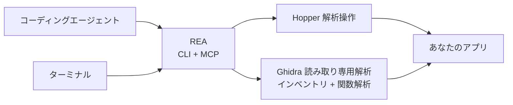

<div align="center">

[English](README.md) · [简体中文](README_zh.md) · **日本語** · [한국어](README_ko.md) · [العربية](README_ar.md)

# REA：あらゆるものをリバースエンジニアリング

### コーディングエージェントがあらゆるものをリバースエンジニアリングするための、ひとつの CLI / MCP サーバー

**気になる機能を見つけ、仕組みを理解し、自分の形で実装する。**

[](https://www.npmjs.com/package/rea-agents)
[](https://github.com/morluto/rea/actions/workflows/ci.yml)
[](#調査ツールカタログ)
[](https://nodejs.org/)
[](LICENSE)

[クイックスタート](#クイックスタート) · [バイナリから動作へ](#バイナリから動作へ) · [ツールカタログ](#調査ツールカタログ) · [仕組み](#仕組み) · [FAQ](#faq)

<br />

<code>curl -fsSL https://raw.githubusercontent.com/morluto/rea/main/install.sh | bash</code>

</div>

---

アプリの気になる機能を自分のプロダクトにも取り入れたいと思ったことはありませんか。ソースコードがなくても、そのアプリをコーディングエージェントに渡せます。REA を使えば、エージェントが機能を調査して仕組みを理解し、あなたの技術スタック、デザイン、要件に合わせた形で実装できます。

REA はこの流れをひとつの CLI / MCP サーバーで実現します。エージェントはコンパイル済みのアプリを調べ、機能の流れを追い、分かったことを通常のコーディング作業に活用できます。複雑なリバースエンジニアリングツールは REA がひとつのインターフェースの裏側で扱います。

## エージェントに頼むだけ

```bash
npx skills add morluto/rea
```

次のように依頼します：

```text
REA をセットアップしてメモアプリをリバースエンジニアリングしてください。
検索の仕組みと判断の理由を示し、私のプロジェクト向けに同様の機能を実装してください。
```

メモアプリは例にすぎません。調べたいアプリを指定するか、まず概要から始めるよう依頼できます。

## バイナリから動作へ

| 逆コンパイル                                                                                                                     | 理解                                                                                                                       | 再現                                                                                       |
| -------------------------------------------------------------------------------------------------------------------------------- | -------------------------------------------------------------------------------------------------------------------------- | ------------------------------------------------------------------------------------------ |
| ネイティブアプリや実行ファイルから、プロシージャ、疑似コード、アセンブリ、文字列、シンボル、セグメント、メタデータを復元します。 | 呼び出し元、呼び出し先、クロスリファレンス、コールグラフをたどり、機能やアルゴリズムの実際の動作を説明できる状態にします。 | エージェントが得た知見を、あなたの技術スタック、画面、要件に合うプロダクト機能へ変えます。 |

REA は調査をバイナリ上の根拠に結び付けます。元のソースコードを復元したり、アプリ全体を自動複製したりするとは主張しません。

## REA を選ぶ理由

|                        |                                                                                       |
| ---------------------- | ------------------------------------------------------------------------------------- |
| **エージェント向け**   | コンパイル済みアプリについて質問し、推測ではなく根拠を集めさせることができます。      |
| **CLI と MCP**         | ターミナルとコーディングエージェントから同じリバースエンジニアリング機能を使えます。  |
| **複雑さを処理**       | ツール設定、アプリの読み込み、調査の維持、終了後のクリーンアップを REA が担います。   |
| **一連の調査に対応**   | 最初の概要から疑似コード、呼び出し関係、型、実装の手掛かりまで掘り下げられます。      |
| **ローカルで解析**     | 解析は Mac 上で実行され、REA がバイナリをホスト型解析サービスへ送ることはありません。 |
| **コンテキストを維持** | 質問ごとに解析を最初からやり直さず、複数のバイナリを続けて調査できます。              |

## クイックスタート

### コーディングエージェントから（推奨）

```bash
npx skills add morluto/rea
```

エージェントに REA のセットアップを依頼してください。Mac を確認し、必要なインストールを説明して承認を求め、システムプロンプトを案内します。完全なツールを読み込むため再起動を求められた場合は、セットアップ後に再起動してください。

### 始める前に

- macOS 12 以降
- Ubuntu 24.04+、Fedora 41+、または 64 ビット Arch Linux
- Node.js 22.19+ または 24.11+ と、Node に付属する npm

`rea setup` は変更計画を表示し、確認後に適用します。Homebrew、Node.js、npm をインストールまたは更新しません。[Hopper](https://www.hopperapp.com/) がない場合は公式パッケージを提案します。Hopper は別製品で、ライセンスは別途必要です。

64 ビット Linux に Ghidra 12.1.2 PUBLIC と完全な 64 ビット JDK 21 がすでにある場合、Setup は承認後に `GHIDRA_INSTALL_DIR` と任意の `JAVA_HOME` も登録できます。REA は Ghidra や Java をダウンロード、インストール、変更しません。Ghidra プロバイダーは隔離された読み取り専用 headless セッションで、インベントリ、逆コンパイル、アセンブリ、呼び出し関係、型付き参照、xref、CFG、関数 dossier を提供します。GUI 状態と変更操作は引き続き利用できません。

#### Linux のインストールとトラブルシューティング

Ubuntu 24.04+、Fedora 41+、64 ビット Arch Linux では、REA が公式の DEB、RPM、または Arch パッケージを取得し、公開されたサイズとチェックサムを検証してから `apt-get`、`dnf`、または `pacman` で依存関係を解決します。root 以外では `pkexec` がシステム承認を表示します。REA は `sudo` を呼び出しません。

既定のランチャーは `/opt/hopper/bin/Hopper` です。別の場所では `HOPPER_LAUNCHER_PATH` を設定してください。Doctor が解析エンジン不足を報告した場合は `ldd /opt/hopper/bin/Hopper | grep 'not found'` を実行し、不足ライブラリを入れて `rea setup` を再実行します。REA は対応する Hopper デモ版を専用 Xvfb ディスプレイで起動し、解析セッションごとに Hopper が提示するデモモードを選択します。デスクトップの `DISPLAY` や有料ライセンスは不要ですが、デモ版にはベンダー所定の制限があります。`~/.local/bin` も `PATH` に追加してください。

```bash
# 1. REA をセットアップ
curl -fsSL https://raw.githubusercontent.com/morluto/rea/main/install.sh | bash
npx -y rea-agents setup
```

macOS やインストーラーから確認を求められた場合は、その操作を完了してから同じコマンドをもう一度実行してください。

### 2. コーディングエージェントを再起動

Setup は Claude Code、Claude Desktop、Codex、Cursor、Gemini CLI、Windsurf、Devin を検出します。検出した最初の 6 クライアントは自動設定しますが、Devin はローカル MCP 設定境界が文書化されていないため、検出結果を報告するだけで変更しません。設定されたクライアントを再起動して REA を読み込んでください。

### 3. エージェントに依頼

アプリは名前で指定できます。コーディングエージェントがアプリを探し、REA に必要なプログラムファイルを渡します。

```text
REA でメモアプリをリバースエンジニアリングしてください。検索機能の仕組みと
根拠を示し、SQLite を使って私のプロジェクト向けに同様の機能を実装してください。
```

問題がある場合は次を実行します：

```bash
npx -y rea-agents doctor
rea uninstall
rea uninstall --purge-data
```

## ひとつのプロンプトで調査を完結

```text
メモアプリをリバースエンジニアリングし、オフライン検索機能の仕組みを説明して、
TypeScript と SQLite を使って私のプロジェクト向けに実装してください。
```

| 手順 | エージェントの処理             | REA ツール                                                       |
| ---: | ------------------------------ | ---------------------------------------------------------------- |
|    1 | バイナリを開いて識別           | `open_binary`, `binary_overview`                                 |
|    2 | オフライン検索の手掛かりを探す | `search_strings`, `search_procedures`, `list_names`              |
|    3 | 手掛かりと実行コードを接続     | `find_xrefs_to_name`, `xrefs`, `procedure_callers`               |
|    4 | 制御フローを復元               | `get_call_graph`, `procedure_callees`, `procedure_info`          |
|    5 | 関連する処理を逆コンパイル     | `procedure_pseudo_code`, `procedure_assembly`, `batch_decompile` |
|    6 | プロジェクトに機能を実装する   | 技術スタック、プロダクト、要件に合わせたコード                   |

REA は手順 1〜5 のバイナリ解析を処理し、手順 6 はエージェントの通常の編集・テストツールが行います。

## エージェントにできること

- ソースコードがない機能の仕組みを説明する。
- アプリの認証、保存、更新、ネットワークフローを復元する。
- 非公開の形式やインターフェースを文書化できる構造を回収する。
- 文字列やシンボルから疑わしい動作の実装コードまで追跡する。
- 同じセッションで 2 バージョンを切り替え、実装経路を比較する。
- 気になる機能を調査し、自分のプロダクトに合わせた形で実装する。
- 復元した動作をプロダクト機能、テスト、移行ノート、移植、相互運用できる代替実装へ変換する。
- Swift / Objective-C のメタデータを解析する。
- Hopper に名前、コメント、ブックマークを残し、人間とエージェントの調査を共有する。

## 調査ツールカタログ

| ツール群               |  数 | 例                                                                                                                                                                            |
| ---------------------- | --: | ----------------------------------------------------------------------------------------------------------------------------------------------------------------------------- |
| バイナリ調査           |  33 | プロシージャ、疑似コード、アセンブリ、文字列、名前、セグメント、callers、callees、xrefs、注釈                                                                                 |
| 合成解析               |  10 | `binary_overview`, `analyze_function`, `batch_decompile`, `get_call_graph`, `find_xrefs_to_name`, Swift / ObjC 検出                                                           |
| macOS ネイティブ       |   5 | Mach-O メタデータ、署名、plist、アーキテクチャ、Swift デマングル。Hopper 起動不要                                                                                             |
| アーティファクトグラフ |   2 | ディレクトリ、ZIP/APK/IPA、ASAR の決定的一覧と明示選択されたトランザクション抽出                                                                                              |
| Managed PE/CLI         |   7 | PE/CLI 識別、メタデータメンバー、CIL ハッシュ、P/Invoke/ネイティブ境界宣言と検証、逆コンパイル再構成インポート、構造的 token 再マッピング、ランタイム相関計画、バージョン比較 |
| ブラウザ観察           |   8 | origin 限定 CDP 取得、bundle/source map 解析、WebMCP 検出、セッション、capture diff、視覚証拠                                                                                 |
| Electron 解析          |   4 | canonical ファイルルート内の受動観察、有界な静的アプリマッピング、Evidence に基づく静的/実行時の照合                                                                          |
| アプリケーション       |   3 | 有界なクロスレイヤー追跡、一意限定のバージョン比較、承認済み Linux 隔離 extracted-module replay                                                                               |
| バイナリセッション     |  18 | `open_binary`、`binary_session`、証拠バンドル、プロセス／成果物／関数比較、残余未知レジストリ                                                                                 |

## 他のコーディングエージェントで使う

Setup は Claude Code、Claude Desktop、Codex、Cursor、Gemini CLI、Windsurf、Devin を検出し、最初の 6 クライアントを自動設定します。Devin は検出結果を報告するだけで変更しません。ローカル MCP サーバーに対応するコーディングエージェントなら、次の設定で REA を利用できます。

```json
{
  "mcpServers": {
    "rea": {
      "command": "npx",
      "args": ["-y", "rea-agents", "mcp"]
    }
  }
}
```

## 仕組み



CLI と MCP サーバーは同じ解析エンジンを使います。ターミナルのコマンドは終了時にアプリを閉じ、エージェントのセッションは調査中アプリを開いたままにします。

## CLI

上のエージェントワークフローが、REA を使う最も簡単な方法です。ターミナルから一度だけアプリの概要を調べる場合は、次を実行します。

```bash
npx -y rea-agents analyze /Applications/Notes.app
```

直接デコンパイルする方法やその他のオプションは、`npx -y rea-agents --help` で確認できます。

グローバルな `rea` コマンドとしてもインストールできます。

```bash
npm install --global rea-agents
rea --help
rea mcp
```

REA は Mac の `.app` フォルダーを直接開けます。エージェントがアプリを見つけられない場合は、インストール場所を伝えてください。

## Hopper アプリの動作

REA は必要なときに Hopper を起動します。Hopper のランチャーは内部でアプリをアクティブ化するため、ターゲットを開くと Hopper が前面に出る場合があります。REA はバックグラウンド起動を要求しますが、常に背面に留まる保証はありません。

明示的な形式・アーキテクチャ引数により一般的な FAT / ARM 選択ダイアログを避けますが、別の Hopper / macOS ダイアログは人の操作を必要とする場合があります。セッションを閉じるとブリッジとソケットを削除しますが、ユーザーが利用中の Hopper は終了しません。

## セキュリティモデル

各セッションはランダムな capability token と現在のユーザーだけが使える Unix ソケットを使用します。Ghidra セッションは隔離された一時プロジェクトも使用し、ユーザー所有の Ghidra プロジェクトを開いたり変更したりしません。これはサンドボックスではなく、同じ OS ユーザー権限で動作する悪意あるプロセスを防御しません。信頼できないバイナリの解析は、現在のユーザー権限で選択されたローカルプロバイダーに委譲されます。脆弱性は [SECURITY.md](SECURITY.md) の非公開手順で報告してください。

## FAQ

<details><summary><strong>Hopper を先に起動する必要がありますか？</strong></summary>

いいえ。REA が必要時に起動します。すでに起動している Hopper にも対応します。

</details>

<details><summary><strong>REA に Hopper は含まれますか？</strong></summary>

含まれません。Setup で Hopper をインストールできますが、Hopper は独自のライセンスを持つ別製品です。REA は CLI、MCP サーバー、エージェント向けワークフローを提供します。

</details>

<details><summary><strong>バイナリはアップロードされますか？</strong></summary>

REA にホスト型解析サービスはありません。ローカル Unix ソケット経由で Hopper を操作します。エージェントやモデル提供者のデータポリシーは別途確認してください。

</details>

<details><summary><strong>元のソースコードを復元できますか？</strong></summary>

保証できません。REA は疑似コード、アセンブリ、シンボル、文字列、メタデータ、関係を提供し、エージェントが観察した動作を説明または互換再現できるようにします。

</details>

## 開発

開発環境、アーキテクチャ、テスト、リリース手順は [CONTRIBUTING.md](CONTRIBUTING.md) を参照してください。

## ライセンス

[MIT](LICENSE)
