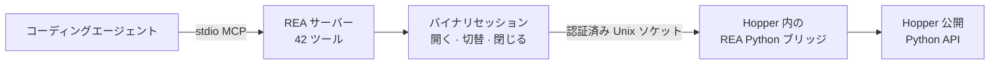

<div align="center">

[English](README.md) · [简体中文](README_zh.md) · **日本語** · [한국어](README_ko.md) · [العربية](README_ar.md)

# REA：あらゆるものをリバースエンジニアリング

### コーディングエージェントがあらゆるものをリバースエンジニアリングするための、ひとつの CLI / MCP サーバー

**気になる機能を見つけ、仕組みを理解し、自分の形で実装する。**

[](https://www.npmjs.com/package/@morluto/rea)
[](https://github.com/morluto/rea/actions/workflows/ci.yml)
[](#42-ツールのワークベンチ)
[](https://nodejs.org/)
[](LICENSE)

[クイックスタート](#クイックスタート) · [バイナリから動作へ](#バイナリから動作へ) · [42 ツール](#42-ツールのワークベンチ) · [仕組み](#仕組み) · [FAQ](#faq)

<br />

<code>npx -y @morluto/rea setup --yes</code>

</div>

---

アプリの気になる機能を自分のプロダクトにも取り入れたいと思ったことはありませんか。ソースコードがなくても、そのアプリをコーディングエージェントに渡せます。REA を使えば、エージェントが機能を調査して仕組みを理解し、あなたの技術スタック、デザイン、要件に合わせた形で実装できます。

REA はこの流れをひとつの CLI / MCP サーバーで実現します。エージェントは疑似コードを復元し、関数をまたぐ動作を追跡し、文字列や型を調べ、その根拠を通常のコーディング作業へ直接持ち込めます。REA はツールチェーン、解析セッション、ターゲットのライフサイクルをひとつのインターフェースで扱います。

## バイナリから動作へ

| 逆コンパイル                                                                                                                     | 理解                                                                                                                       | 再現                                                                                       |
| -------------------------------------------------------------------------------------------------------------------------------- | -------------------------------------------------------------------------------------------------------------------------- | ------------------------------------------------------------------------------------------ |
| ネイティブアプリや実行ファイルから、プロシージャ、疑似コード、アセンブリ、文字列、シンボル、セグメント、メタデータを復元します。 | 呼び出し元、呼び出し先、クロスリファレンス、コールグラフをたどり、機能やアルゴリズムの実際の動作を説明できる状態にします。 | エージェントが得た知見を、あなたの技術スタック、画面、要件に合うプロダクト機能へ変えます。 |

REA は調査をバイナリ上の根拠に結び付けます。元のソースコードを復元したり、アプリ全体を自動複製したりするとは主張しません。

## REA を選ぶ理由

|                        |                                                                                       |
| ---------------------- | ------------------------------------------------------------------------------------- |
| **エージェント向け**   | コンパイル済みアプリについて質問し、推測ではなく根拠を集めさせることができます。      |
| **CLI と MCP**         | ターミナルとコーディングエージェントから同じリバースエンジニアリング機能を使えます。  |
| **複雑さを処理**       | ツール設定、アプリの読み込み、調査の維持、終了後のクリーンアップを REA が担います。   |
| **一連の調査に対応**   | 最初の概要から疑似コード、呼び出し関係、型、実装の手掛かりまで掘り下げられます。      |
| **ローカルで解析**     | 解析は Mac 上で実行され、REA がバイナリをホスト型解析サービスへ送ることはありません。 |
| **コンテキストを維持** | 質問ごとに解析を最初からやり直さず、複数のバイナリを続けて調査できます。              |

## クイックスタート

### 必要環境

- macOS 12 以降
- Node.js 22 以降
- [Hopper Disassembler](https://www.hopperapp.com/)

REA に Hopper は含まれません。Setup は必要に応じて Homebrew と `hopper-disassembler` cask をインストールし、検出した Claude Desktop / Cursor の MCP 設定と REA エージェントスキルを構成します。既存設定はバックアップされ、アトミックに更新された後、読み戻し検証されます。

```bash
# 1. インストールと設定
npx -y @morluto/rea setup --yes

# 2. 統合を診断
npx -y @morluto/rea doctor

# 3. stdio MCP サーバーを起動
npx -y @morluto/rea mcp
```

MCP コマンドは stdio で通信するため、クライアント接続を静かに待ちます。Setup がクライアントを構成した場合は、そのクライアントを再起動して登録済みの `rea` サーバーを使用してください。

エージェントへの依頼例：

```text
/path/to/MyApp を開き、バイナリの概要を示し、認証フローを見つけ、
関連プロシージャを逆コンパイルして、結論を支える根拠を提示してください。
```

## ひとつのプロンプトで調査を完結

```text
MyApp を開き、オフライン検索機能の仕組みと制御フローを説明し、
TypeScript と SQLite を使って私のプロジェクト向けに実装してください。
```

| 手順 | エージェントの処理             | REA ツール                                                       |
| ---: | ------------------------------ | ---------------------------------------------------------------- |
|    1 | バイナリを開いて識別           | `open_binary`, `binary_overview`                                 |
|    2 | オフライン検索の手掛かりを探す | `search_strings`, `search_procedures`, `list_names`              |
|    3 | 手掛かりと実行コードを接続     | `find_xrefs_to_name`, `xrefs`, `procedure_callers`               |
|    4 | 制御フローを復元               | `get_call_graph`, `procedure_callees`, `procedure_info`          |
|    5 | 実装を復元                     | `procedure_pseudo_code`, `procedure_assembly`, `batch_decompile` |
|    6 | プロジェクトに機能を実装する   | 技術スタック、プロダクト、要件に合わせたコード                   |

REA は手順 1〜5 のバイナリ解析を処理し、手順 6 はエージェントの通常の編集・テストツールが行います。

## エージェントにできること

- ソースコードがない機能の仕組みを説明する。
- アプリの認証、保存、更新、ネットワークフローを復元する。
- 非公開の形式やインターフェースを文書化できる構造を回収する。
- 文字列やシンボルから疑わしい動作の実装コードまで追跡する。
- 同じセッションで 2 バージョンを切り替え、実装経路を比較する。
- 気になる機能を調査し、自分のプロダクトに合わせた形で実装する。
- 復元した動作をプロダクト機能、テスト、移行ノート、移植、相互運用できる代替実装へ変換する。
- Swift / Objective-C のメタデータを解析する。
- Hopper に名前、コメント、ブックマークを残し、人間とエージェントの調査を共有する。

## 42 ツールのワークベンチ

| ツール群           |  数 | 例                                                                                              |
| ------------------ | --: | ----------------------------------------------------------------------------------------------- |
| バイナリ調査       |  31 | プロシージャ、疑似コード、アセンブリ、文字列、名前、セグメント、callers、callees、xrefs、注釈   |
| 合成解析           |   8 | `binary_overview`, `batch_decompile`, `get_call_graph`, `find_xrefs_to_name`, Swift / ObjC 検出 |
| バイナリセッション |   3 | `open_binary`, `binary_session`, `close_binary`                                                 |

公開ツール一覧は契約テストと分離されたパッケージ MCP クライアントで検証されています。実 Hopper 検証では 2 つのバイナリを使って同じ 42 ツールを確認します。

## MCP ワークフロー

1. `open_binary` で読み取り可能なローカルバイナリまたは `.hop` を開きます。
2. `binary_overview` から始め、文字列、シンボル、逆コンパイル、callers、callees、xrefs で範囲を絞ります。
3. `open_binary` を再度呼び出してターゲットを切り替えます。失敗時は以前のターゲットを再度開きます。
4. 終了時に `close_binary` を呼びます。`binary_session` はいつでも状態を返します。

REA は Mach-O/FAT、ELF、PE、Hopper データベースを自動判定します。相対パスは MCP サーバーの作業ディレクトリ基準で、FAT バイナリではホスト互換アーキテクチャを選択します。

### MCP 手動設定

```json
{
  "mcpServers": {
    "rea": {
      "command": "npx",
      "args": ["-y", "@morluto/rea", "mcp"]
    }
  }
}
```

## 仕組み



CLI と MCP アダプターは同じセッション・解析ランタイムを直接使用し、互いを呼び出しません。単発コマンドは処理ごとにリソースを閉じ、MCP モードは複数の呼び出しやターゲット切り替えをまたいでセッションを維持します。

## CLI

```bash
npx -y @morluto/rea --help
npx -y @morluto/rea doctor --target /path/to/binary
npx -y @morluto/rea analyze /path/to/binary
npx -y @morluto/rea decompile /path/to/binary 0x100003f20
```

グローバルな `rea` コマンドとしてもインストールできます。

```bash
npm install --global @morluto/rea
rea --help
rea mcp
```

## Hopper アプリの動作

REA は必要なときに Hopper を起動します。Hopper のランチャーは内部でアプリをアクティブ化するため、ターゲットを開くと Hopper が前面に出る場合があります。REA はバックグラウンド起動を要求しますが、常に背面に留まる保証はありません。

明示的な形式・アーキテクチャ引数により一般的な FAT / ARM 選択ダイアログを避けますが、別の Hopper / macOS ダイアログは人の操作を必要とする場合があります。セッションを閉じるとブリッジとソケットを削除しますが、ユーザーが利用中の Hopper は終了しません。

## セキュリティモデル

各セッションはランダムな capability token と現在のユーザーだけが使える Unix ソケットを使用します。これはサンドボックスではなく、同じユーザー権限で動作する悪意あるプロセスを防御しません。信頼できないバイナリの解析は、現在の macOS ユーザー権限で Hopper に委譲されます。脆弱性は [SECURITY.md](SECURITY.md) の非公開手順で報告してください。

## FAQ

<details><summary><strong>Hopper を先に起動する必要がありますか？</strong></summary>

いいえ。REA が必要時に起動します。すでに起動している Hopper にも対応します。

</details>

<details><summary><strong>REA に Hopper は含まれますか？</strong></summary>

含まれません。Hopper は別途インストール・ライセンスが必要です。REA は CLI、MCP、セッション、解析ワークフロー、認証ブリッジを提供します。

</details>

<details><summary><strong>バイナリはアップロードされますか？</strong></summary>

REA にホスト型解析サービスはありません。ローカル Unix ソケット経由で Hopper を操作します。エージェントやモデル提供者のデータポリシーは別途確認してください。

</details>

<details><summary><strong>元のソースコードを復元できますか？</strong></summary>

保証できません。REA は疑似コード、アセンブリ、シンボル、文字列、メタデータ、関係を提供し、エージェントが観察した動作を説明または互換再現できるようにします。

</details>

## 開発

```bash
npm ci
npm run check
npm run verify:package
npm pack --dry-run
```

実 Hopper 検証には異なる 2 つのバイナリが必要です。

```bash
HOPPER_TARGET_PATH=/path/to/target-a \
HOPPER_SECOND_TARGET_PATH=/path/to/distinct-target-b \
npm run verify:hopper
```

アーキテクチャ規約、Pull Request、リリース手順は [CONTRIBUTING.md](CONTRIBUTING.md) を参照してください。

## ライセンス

[MIT](LICENSE)
