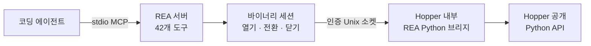

<div align="center">

[English](README.md) · [简体中文](README_zh.md) · [日本語](README_ja.md) · **한국어** · [العربية](README_ar.md)

# REA: 무엇이든 리버스 엔지니어링

### 코딩 에이전트가 무엇이든 리버스 엔지니어링할 수 있게 하는 하나의 CLI 및 MCP 서버

**마음에 드는 기능을 찾고, 작동 방식을 이해하고, 원하는 방식으로 구현하세요.**

[](https://www.npmjs.com/package/@morluto/rea)
[](https://github.com/morluto/rea/actions/workflows/ci.yml)
[](#42개-도구로-구성된-워크벤치)
[](https://nodejs.org/)
[](LICENSE)

[빠른 시작](#빠른-시작) · [바이너리에서 동작까지](#바이너리에서-동작까지) · [42개 도구](#42개-도구로-구성된-워크벤치) · [작동 방식](#작동-방식) · [FAQ](#faq)

<br />

<code>npx -y @morluto/rea setup --yes</code>

</div>

---

어떤 앱에서 마음에 드는 기능을 자신의 제품에도 넣고 싶나요? 소스 코드가 없어도 앱을 코딩 에이전트에 전달할 수 있습니다. REA를 사용하면 에이전트가 기능을 조사하고 작동 방식을 이해한 뒤, 사용자의 기술 스택, 디자인, 요구 사항에 맞는 버전을 구현할 수 있습니다.

REA는 이 과정을 하나의 CLI 및 MCP 서버로 제공합니다. 에이전트는 의사 코드를 복구하고, 함수 사이의 동작을 추적하고, 문자열과 타입을 조사한 뒤 그 증거를 일반 코딩 작업에 바로 활용할 수 있습니다. REA는 도구 체인, 분석 세션, 대상 수명 주기를 하나의 인터페이스로 처리합니다.

## 바이너리에서 동작까지

| 디컴파일                                                                                                      | 이해                                                                                        | 재현                                                                                      |
| ------------------------------------------------------------------------------------------------------------- | ------------------------------------------------------------------------------------------- | ----------------------------------------------------------------------------------------- |
| 네이티브 앱이나 실행 파일에서 프로시저, 의사 코드, 어셈블리, 문자열, 심볼, 세그먼트, 메타데이터를 복구합니다. | 호출자, 피호출자, 상호 참조, 호출 그래프를 따라 기능이나 알고리즘의 실제 동작을 설명합니다. | 에이전트가 배운 내용을 사용자의 기술 스택, 화면, 요구 사항에 맞는 제품 기능으로 만듭니다. |

REA는 분석을 바이너리 증거에 근거하게 합니다. 원본 소스 코드를 복원하거나 앱 전체를 자동으로 복제한다고 주장하지 않습니다.

## REA를 사용하는 이유

|                    |                                                                                    |
| ------------------ | ---------------------------------------------------------------------------------- |
| **에이전트용**     | 컴파일된 앱에 관해 질문하고 추측 대신 증거를 수집하게 합니다.                      |
| **CLI와 MCP**      | 터미널과 코딩 에이전트에서 동일한 리버스 엔지니어링 기능을 사용합니다.             |
| **복잡성 처리**    | 도구 설정, 앱 열기, 조사 유지, 작업 후 정리를 REA가 처리합니다.                    |
| **전체 조사 과정** | 첫 개요에서 의사 코드, 호출 관계, 타입, 구현 단서까지 이어서 조사합니다.           |
| **로컬 분석**      | 분석은 Mac에서 실행되며 REA는 바이너리를 호스팅 분석 서비스에 업로드하지 않습니다. |
| **컨텍스트 유지**  | 질문마다 분석을 처음부터 시작하지 않고 여러 바이너리를 연속으로 조사합니다.        |

## 빠른 시작

### 요구 사항

- macOS 12 이상
- Node.js 22 이상
- [Hopper Disassembler](https://www.hopperapp.com/)

REA는 Hopper를 번들하지 않습니다. Setup은 필요할 때 Homebrew와 `hopper-disassembler` cask를 설치하고, 감지된 Claude Desktop 및 Cursor MCP 클라이언트와 REA 에이전트 스킬을 구성합니다. 기존 설정은 백업되고 원자적으로 갱신된 뒤 다시 읽어 검증합니다.

```bash
# 1. 설치 및 구성
npx -y @morluto/rea setup --yes

# 2. 통합 진단
npx -y @morluto/rea doctor

# 3. stdio MCP 서버 시작
npx -y @morluto/rea mcp
```

MCP 명령은 stdio로 통신하므로 클라이언트 연결을 조용히 기다립니다. Setup이 클라이언트를 구성했다면 클라이언트를 다시 시작하고 등록된 `rea` 서버를 사용하세요.

에이전트에게 다음과 같이 요청할 수 있습니다.

```text
/path/to/MyApp을 열고 바이너리를 요약한 다음 인증 흐름을 찾아
관련 프로시저를 디컴파일하고 결론을 뒷받침하는 증거를 보여 주세요.
```

## 하나의 프롬프트로 전체 조사

```text
MyApp을 열고 오프라인 검색 기능의 작동 방식과 제어 흐름을 설명한 다음,
TypeScript와 SQLite를 사용해 제 프로젝트에 맞는 버전을 구현해 주세요.
```

| 단계 | 에이전트 작업           | REA 도구                                                         |
| ---: | ----------------------- | ---------------------------------------------------------------- |
|    1 | 바이너리 열기 및 식별   | `open_binary`, `binary_overview`                                 |
|    2 | 오프라인 검색 단서 찾기 | `search_strings`, `search_procedures`, `list_names`              |
|    3 | 단서를 실행 코드에 연결 | `find_xrefs_to_name`, `xrefs`, `procedure_callers`               |
|    4 | 제어 흐름 재구성        | `get_call_graph`, `procedure_callees`, `procedure_info`          |
|    5 | 구현 복구               | `procedure_pseudo_code`, `procedure_assembly`, `batch_decompile` |
|    6 | 프로젝트에 기능 구현    | 기술 스택, 제품, 요구 사항에 맞는 코드                           |

REA는 1–5단계의 바이너리 분석을 처리합니다. 6단계는 에이전트가 일반 파일 편집 및 테스트 도구로 수행합니다.

## 에이전트가 할 수 있는 일

- 소스 코드가 없는 기능의 동작을 설명합니다.
- 앱의 인증, 저장소, 업데이트 또는 네트워크 흐름을 재구성합니다.
- 문서화되지 않은 형식이나 인터페이스의 구조를 복구합니다.
- 문자열이나 심볼에서 의심스러운 동작을 구현한 코드까지 추적합니다.
- 한 세션에서 두 앱 버전을 전환하며 구현 경로를 비교합니다.
- 마음에 드는 기능을 조사하고 자신의 제품에 맞는 버전으로 구현합니다.
- 복구한 동작을 제품 기능, 테스트, 마이그레이션 문서, 포팅 또는 상호 운용 가능한 대체품으로 변환합니다.
- Swift 및 Objective-C 메타데이터를 분석합니다.
- Hopper에 이름, 주석, 북마크를 남겨 사람과 에이전트의 분석을 연결합니다.

## 42개 도구로 구성된 워크벤치

| 도구 그룹     |  수 | 예시                                                                                             |
| ------------- | --: | ------------------------------------------------------------------------------------------------ |
| 바이너리 검사 |  31 | 프로시저, 의사 코드, 어셈블리, 문자열, 이름, 세그먼트, callers, callees, xrefs, 주석             |
| 합성 분석     |   8 | `binary_overview`, `batch_decompile`, `get_call_graph`, `find_xrefs_to_name`, Swift 및 ObjC 탐색 |
| 바이너리 세션 |   3 | `open_binary`, `binary_session`, `close_binary`                                                  |

공개 도구 목록은 계약 테스트와 격리된 패키지 MCP 클라이언트로 검증됩니다. 실제 Hopper 검증은 서로 다른 두 바이너리에서 같은 42개 도구를 확인합니다.

## MCP 워크플로

1. `open_binary`로 읽을 수 있는 로컬 바이너리 또는 `.hop` 파일을 엽니다.
2. `binary_overview`로 시작하고 문자열, 심볼, 디컴파일, callers, callees, xrefs로 범위를 좁힙니다.
3. `open_binary`를 다시 호출해 대상을 전환합니다. 새 대상이 실패하면 이전 대상을 다시 엽니다.
4. 완료되면 `close_binary`를 호출합니다. `binary_session`은 언제든 현재 상태를 반환합니다.

REA는 Mach-O/FAT, ELF, PE, Hopper 데이터베이스를 자동으로 감지합니다. 상대 경로는 MCP 서버 작업 디렉터리를 기준으로 하며 FAT 바이너리는 호스트와 호환되는 아키텍처를 선택합니다.

### 수동 MCP 구성

```json
{
  "mcpServers": {
    "rea": {
      "command": "npx",
      "args": ["-y", "@morluto/rea", "mcp"]
    }
  }
}
```

## 작동 방식



CLI와 MCP 어댑터는 같은 세션 및 분석 런타임을 직접 사용하며 서로를 호출하지 않습니다. 일회성 명령은 매 작업 후 리소스를 닫고 MCP 모드는 여러 호출과 대상 전환 동안 세션을 유지합니다.

## CLI

```bash
npx -y @morluto/rea --help
npx -y @morluto/rea doctor --target /path/to/binary
npx -y @morluto/rea analyze /path/to/binary
npx -y @morluto/rea decompile /path/to/binary 0x100003f20
```

전역 `rea` 명령으로 설치할 수도 있습니다.

```bash
npm install --global @morluto/rea
rea --help
rea mcp
```

## Hopper 앱 동작

REA는 필요할 때 Hopper를 시작합니다. Hopper 런처는 내부적으로 앱을 활성화하므로 대상을 열 때 Hopper가 다른 창 앞으로 나타날 수 있습니다. REA는 백그라운드 시작을 요청하지만 항상 뒤에 머무르는 것을 보장할 수 없습니다.

명시적인 형식과 아키텍처 인자로 일반적인 FAT/ARM 선택 대화상자를 피하지만, 다른 Hopper 또는 macOS 대화상자에는 사람이 응답해야 할 수 있습니다. 세션 종료 시 브리지와 소켓 디렉터리를 제거하지만 사용자가 작업 중인 Hopper 앱은 종료하지 않습니다.

## 보안 모델

각 세션은 무작위 capability token과 현재 사용자 전용 Unix 소켓을 사용합니다. 이는 샌드박스가 아니며 같은 사용자로 실행되는 악성 프로세스를 방어하지 않습니다. 신뢰할 수 없는 바이너리를 열면 현재 macOS 사용자 권한으로 Hopper가 분석합니다. 취약점은 [SECURITY.md](SECURITY.md)의 비공개 절차로 신고하세요.

## FAQ

<details><summary><strong>Hopper를 미리 실행해야 하나요?</strong></summary>

아니요. REA가 필요할 때 시작하며 이미 실행 중인 Hopper도 지원합니다.

</details>

<details><summary><strong>REA에 Hopper가 포함되나요?</strong></summary>

아니요. Hopper는 별도로 설치하고 라이선스를 받아야 합니다. REA는 CLI, MCP, 세션 관리, 분석 워크플로 및 인증 브리지를 제공합니다.

</details>

<details><summary><strong>바이너리가 업로드되나요?</strong></summary>

REA에는 호스팅 분석 서비스가 없습니다. 로컬 Unix 소켓을 통해 Hopper를 조작합니다. 에이전트나 모델 공급자의 데이터 정책은 별도로 확인하세요.

</details>

<details><summary><strong>원본 소스 코드를 복구할 수 있나요?</strong></summary>

보장할 수 없습니다. REA는 의사 코드, 어셈블리, 심볼, 문자열, 메타데이터 및 관계를 제공하여 에이전트가 관찰된 동작을 설명하거나 호환되게 재현하도록 돕습니다.

</details>

## 개발

```bash
npm ci
npm run check
npm run verify:package
npm pack --dry-run
```

실제 Hopper 검증에는 서로 다른 두 바이너리가 필요합니다.

```bash
HOPPER_TARGET_PATH=/path/to/target-a \
HOPPER_SECOND_TARGET_PATH=/path/to/distinct-target-b \
npm run verify:hopper
```

아키텍처 지침, Pull Request 요구 사항, 릴리스 체크리스트는 [CONTRIBUTING.md](CONTRIBUTING.md)를 참고하세요.

## 라이선스

[MIT](LICENSE)
