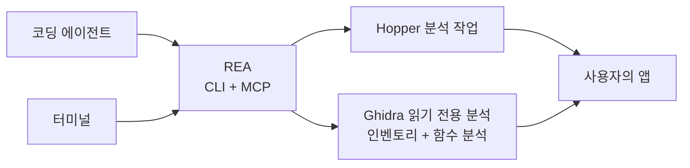

<div align="center">

[English](README.md) · [简体中文](README_zh.md) · [日本語](README_ja.md) · **한국어** · [العربية](README_ar.md)

# REA: 무엇이든 리버스 엔지니어링

### 코딩 에이전트가 무엇이든 리버스 엔지니어링할 수 있게 하는 하나의 CLI 및 MCP 서버

**마음에 드는 기능을 찾고, 작동 방식을 이해하고, 원하는 방식으로 구현하세요.**

[](https://www.npmjs.com/package/rea-agents)
[](https://github.com/morluto/rea/actions/workflows/ci.yml)
[](#80개-도구로-구성된-워크벤치)
[](https://nodejs.org/)
[](LICENSE)

[빠른 시작](#빠른-시작) · [바이너리에서 동작까지](#바이너리에서-동작까지) · [80개 도구](#80개-도구로-구성된-워크벤치) · [작동 방식](#작동-방식) · [FAQ](#faq)

<br />

<code>curl -fsSL https://raw.githubusercontent.com/morluto/rea/main/install.sh | bash</code>

</div>

---

어떤 앱에서 마음에 드는 기능을 자신의 제품에도 넣고 싶나요? 소스 코드가 없어도 앱을 코딩 에이전트에 전달할 수 있습니다. REA를 사용하면 에이전트가 기능을 조사하고 작동 방식을 이해한 뒤, 사용자의 기술 스택, 디자인, 요구 사항에 맞는 버전을 구현할 수 있습니다.

REA는 이 과정을 하나의 CLI 및 MCP 서버로 제공합니다. 에이전트는 컴파일된 앱을 조사하고 기능의 작동 방식을 추적한 뒤 알아낸 내용을 일반 코딩 작업에 활용할 수 있습니다. 복잡한 리버스 엔지니어링 도구는 REA가 하나의 인터페이스 뒤에서 처리합니다.

## 에이전트에게 바로 요청하기

```bash
npx skills add morluto/rea
```

그런 다음 요청하세요.

```text
REA를 설정하고 메모 앱을 리버스 엔지니어링해 주세요. 검색 기능의 작동 방식과
그렇게 판단한 이유를 보여 주고, 제 프로젝트에 비슷한 기능을 구현해 주세요.
```

메모 앱은 예시일 뿐입니다. 이해하고 싶은 앱을 지정하거나 먼저 개요부터 살펴보라고 요청할 수 있습니다.

## 바이너리에서 동작까지

| 디컴파일                                                                                                      | 이해                                                                                        | 재현                                                                                      |
| ------------------------------------------------------------------------------------------------------------- | ------------------------------------------------------------------------------------------- | ----------------------------------------------------------------------------------------- |
| 네이티브 앱이나 실행 파일에서 프로시저, 의사 코드, 어셈블리, 문자열, 심볼, 세그먼트, 메타데이터를 복구합니다. | 호출자, 피호출자, 상호 참조, 호출 그래프를 따라 기능이나 알고리즘의 실제 동작을 설명합니다. | 에이전트가 배운 내용을 사용자의 기술 스택, 화면, 요구 사항에 맞는 제품 기능으로 만듭니다. |

REA는 분석을 바이너리 증거에 근거하게 합니다. 원본 소스 코드를 복원하거나 앱 전체를 자동으로 복제한다고 주장하지 않습니다.

## REA를 사용하는 이유

|                    |                                                                                    |
| ------------------ | ---------------------------------------------------------------------------------- |
| **에이전트용**     | 컴파일된 앱에 관해 질문하고 추측 대신 증거를 수집하게 합니다.                      |
| **CLI와 MCP**      | 터미널과 코딩 에이전트에서 동일한 리버스 엔지니어링 기능을 사용합니다.             |
| **복잡성 처리**    | 도구 설정, 앱 열기, 조사 유지, 작업 후 정리를 REA가 처리합니다.                    |
| **전체 조사 과정** | 첫 개요에서 의사 코드, 호출 관계, 타입, 구현 단서까지 이어서 조사합니다.           |
| **로컬 분석**      | 분석은 Mac에서 실행되며 REA는 바이너리를 호스팅 분석 서비스에 업로드하지 않습니다. |
| **컨텍스트 유지**  | 질문마다 분석을 처음부터 시작하지 않고 여러 바이너리를 연속으로 조사합니다.        |

## 빠른 시작

### 코딩 에이전트에서 시작하기(권장)

```bash
npx skills add morluto/rea
```

에이전트에게 REA 설정을 요청하세요. Mac을 확인하고 필요한 설치 내용을 설명한 뒤 승인을 요청하며 시스템 프롬프트를 안내합니다. 전체 도구를 불러오기 위해 재시작하라고 하면 설정 후 에이전트를 재시작하세요.

### 시작하기 전에

- macOS 12 이상
- Ubuntu 24.04+, Fedora 41+ 또는 64비트 Arch Linux
- Node.js 22.19+ 또는 24.11+ 및 Node와 함께 제공되는 npm

`rea setup`은 전체 변경 계획을 표시하고 확인 후 적용합니다. Homebrew, Node.js 또는 npm을 설치하거나 업데이트하지 않습니다. [Hopper](https://www.hopperapp.com/)가 없으면 공식 패키지 설치를 제안합니다. Hopper는 별도 라이선스가 필요한 독립 소프트웨어입니다.

64비트 Linux에 Ghidra 12.1.2 PUBLIC과 완전한 64비트 JDK 21이 이미 설치되어 있다면 Setup은 승인 후 `GHIDRA_INSTALL_DIR`과 선택 사항인 `JAVA_HOME`도 등록할 수 있습니다. REA는 Ghidra나 Java를 다운로드, 설치 또는 수정하지 않습니다. Ghidra 공급자는 격리된 읽기 전용 headless 세션에서 인벤토리, 디컴파일, 어셈블리, 호출 관계, 형식이 지정된 참조, xref, CFG 및 함수 dossier를 제공합니다. GUI 상태와 변경 작업은 계속 사용할 수 없습니다.

#### Linux 설치 및 문제 해결

Ubuntu 24.04+, Fedora 41+, 64비트 Arch Linux에서 REA는 공식 DEB, RPM 또는 Arch 패키지를 내려받아 게시된 크기와 체크섬을 검증한 뒤 `apt-get`, `dnf` 또는 `pacman`으로 의존성을 설치합니다. root가 아니면 `pkexec`가 시스템 승인 창을 표시합니다. REA는 `sudo`를 호출하지 않습니다.

기본 실행 파일은 `/opt/hopper/bin/Hopper`입니다. 다른 위치에 설치했다면 `HOPPER_LAUNCHER_PATH`를 설정하세요. Doctor가 분석 엔진 누락을 보고하면 `ldd /opt/hopper/bin/Hopper | grep 'not found'`를 실행하고 누락된 라이브러리를 설치한 다음 `rea setup`을 다시 실행하세요. REA는 지원되는 Hopper 데모 빌드를 전용 Xvfb 디스플레이에서 실행하고 분석 세션마다 Hopper가 제공하는 데모 모드를 선택합니다. 데스크톱 `DISPLAY`나 유료 라이선스는 필요하지 않지만 데모에는 공급업체가 정한 제한이 있습니다. `~/.local/bin`도 `PATH`에 추가해야 합니다.

```bash
# 1. REA 설정
curl -fsSL https://raw.githubusercontent.com/morluto/rea/main/install.sh | bash
npx -y rea-agents setup
```

macOS나 설치 프로그램이 확인을 요청하면 해당 절차를 완료하고 같은 명령을 다시 실행하세요.

### 2. 코딩 에이전트 재시작

Setup은 Claude Code, Claude Desktop, Codex, Cursor, Gemini CLI, Windsurf, Devin을 감지합니다. 감지된 앞의 여섯 클라이언트는 자동으로 구성하지만, Devin은 문서화된 로컬 MCP 구성 경계가 없어 감지만 보고하고 변경하지 않습니다. 구성된 클라이언트를 다시 시작해 REA를 불러오세요.

### 3. 에이전트에게 요청

앱 이름만 말해도 됩니다. 코딩 에이전트가 앱을 찾아 REA에 필요한 프로그램 파일을 전달합니다.

```text
REA로 메모 앱을 리버스 엔지니어링해 주세요. 검색 기능의 작동 방식과 증거를 보여 주고,
SQLite를 사용해 제 프로젝트에 비슷한 기능을 구현해 주세요.
```

문제가 있으면 다음을 실행하세요.

```bash
npx -y rea-agents doctor
rea uninstall
rea uninstall --purge-data
```

## 하나의 프롬프트로 전체 조사

```text
메모 앱을 리버스 엔지니어링해 오프라인 검색 기능의 작동 방식을 설명한 다음,
TypeScript와 SQLite를 사용해 제 프로젝트에 맞는 버전을 구현해 주세요.
```

| 단계 | 에이전트 작업           | REA 도구                                                         |
| ---: | ----------------------- | ---------------------------------------------------------------- |
|    1 | 바이너리 열기 및 식별   | `open_binary`, `binary_overview`                                 |
|    2 | 오프라인 검색 단서 찾기 | `search_strings`, `search_procedures`, `list_names`              |
|    3 | 단서를 실행 코드에 연결 | `find_xrefs_to_name`, `xrefs`, `procedure_callers`               |
|    4 | 제어 흐름 재구성        | `get_call_graph`, `procedure_callees`, `procedure_info`          |
|    5 | 관련 루틴 디컴파일      | `procedure_pseudo_code`, `procedure_assembly`, `batch_decompile` |
|    6 | 프로젝트에 기능 구현    | 기술 스택, 제품, 요구 사항에 맞는 코드                           |

REA는 1–5단계의 바이너리 분석을 처리합니다. 6단계는 에이전트가 일반 파일 편집 및 테스트 도구로 수행합니다.

## 에이전트가 할 수 있는 일

- 소스 코드가 없는 기능의 동작을 설명합니다.
- 앱의 인증, 저장소, 업데이트 또는 네트워크 흐름을 재구성합니다.
- 문서화되지 않은 형식이나 인터페이스의 구조를 복구합니다.
- 문자열이나 심볼에서 의심스러운 동작을 구현한 코드까지 추적합니다.
- 한 세션에서 두 앱 버전을 전환하며 구현 경로를 비교합니다.
- 마음에 드는 기능을 조사하고 자신의 제품에 맞는 버전으로 구현합니다.
- 복구한 동작을 제품 기능, 테스트, 마이그레이션 문서, 포팅 또는 상호 운용 가능한 대체품으로 변환합니다.
- Swift 및 Objective-C 메타데이터를 분석합니다.
- Hopper에 이름, 주석, 북마크를 남겨 사람과 에이전트의 분석을 연결합니다.

## 80개 도구로 구성된 워크벤치

| 도구 그룹           |  수 | 예시                                                                                                                 |
| ------------------- | --: | -------------------------------------------------------------------------------------------------------------------- |
| 바이너리 검사       |  33 | 프로시저, 의사 코드, 어셈블리, 문자열, 이름, 세그먼트, callers, callees, xrefs, 주석                                 |
| 합성 분석           |  10 | `binary_overview`, `analyze_function`, `batch_decompile`, `get_call_graph`, `find_xrefs_to_name`, Swift 및 ObjC 탐색 |
| macOS 네이티브 도구 |   5 | Mach-O 메타데이터, 코드 서명, plist, 아키텍처, Swift 디맹글링. Hopper 실행 불필요                                    |
| 아티팩트 그래프     |   2 | 디렉터리, ZIP/APK/IPA, ASAR 결정적 인벤토리와 명시적으로 선택한 트랜잭션 추출                                        |
| 브라우저 관찰       |   8 | origin 제한 CDP 캡처, bundle/source map 분석, WebMCP 검색, 세션 타임라인, capture diff 및 시각 증거                  |
| Electron 분석       |   4 | canonical 파일 루트 내 수동 관찰, 제한된 정적 앱 매핑, Evidence 기반 정적/런타임 조정                                |
| 바이너리 세션       |  18 | `open_binary`, `binary_session`, 증거 번들, 프로세스·아티팩트·함수 비교, 잔여 미지수 레지스트리                      |

## 다른 코딩 에이전트에서 사용하기

Setup은 Claude Code, Claude Desktop, Codex, Cursor, Gemini CLI, Windsurf, Devin을 감지하고 앞의 여섯 클라이언트를 자동으로 구성합니다. Devin은 감지만 보고하고 변경하지 않습니다. 로컬 MCP 서버를 지원하는 코딩 에이전트라면 다음 설정으로 REA를 사용할 수 있습니다.

```json
{
  "mcpServers": {
    "rea": {
      "command": "npx",
      "args": ["-y", "rea-agents", "mcp"]
    }
  }
}
```

## 작동 방식



CLI와 MCP 서버는 같은 분석 엔진을 사용합니다. 터미널 명령은 끝날 때 앱을 닫고, 에이전트 세션은 조사하는 동안 앱을 열어 둡니다.

## CLI

위의 에이전트 워크플로가 REA를 사용하는 가장 쉬운 방법입니다. 터미널에서 앱을 한 번 빠르게 살펴보려면 다음을 실행하세요.

```bash
npx -y rea-agents analyze /Applications/Notes.app
```

직접 디컴파일하는 방법과 기타 옵션은 `npx -y rea-agents --help`에서 확인할 수 있습니다.

전역 `rea` 명령으로 설치할 수도 있습니다.

```bash
npm install --global rea-agents
rea --help
rea mcp
```

REA는 Mac의 `.app` 폴더를 직접 열 수 있습니다. 에이전트가 앱을 찾지 못하면 설치 위치를 알려 주세요.

## Hopper 앱 동작

REA는 필요할 때 Hopper를 시작합니다. Hopper 런처는 내부적으로 앱을 활성화하므로 대상을 열 때 Hopper가 다른 창 앞으로 나타날 수 있습니다. REA는 백그라운드 시작을 요청하지만 항상 뒤에 머무르는 것을 보장할 수 없습니다.

명시적인 형식과 아키텍처 인자로 일반적인 FAT/ARM 선택 대화상자를 피하지만, 다른 Hopper 또는 macOS 대화상자에는 사람이 응답해야 할 수 있습니다. 세션 종료 시 브리지와 소켓 디렉터리를 제거하지만 사용자가 작업 중인 Hopper 앱은 종료하지 않습니다.

## 보안 모델

각 세션은 무작위 capability token과 현재 사용자 전용 Unix 소켓을 사용합니다. Ghidra 세션은 격리된 임시 프로젝트도 사용하며 사용자 소유 Ghidra 프로젝트를 열거나 수정하지 않습니다. 이는 샌드박스가 아니며 같은 운영 체제 사용자로 실행되는 악성 프로세스를 방어하지 않습니다. 신뢰할 수 없는 바이너리를 열면 선택한 로컬 공급자가 현재 사용자 권한으로 분석합니다. 취약점은 [SECURITY.md](SECURITY.md)의 비공개 절차로 신고하세요.

## FAQ

<details><summary><strong>Hopper를 미리 실행해야 하나요?</strong></summary>

아니요. REA가 필요할 때 시작하며 이미 실행 중인 Hopper도 지원합니다.

</details>

<details><summary><strong>REA에 Hopper가 포함되나요?</strong></summary>

아니요. Setup이 Hopper를 설치할 수 있지만 Hopper는 자체 라이선스가 필요한 별도 소프트웨어입니다. REA는 CLI, MCP 서버, 에이전트용 워크플로를 제공합니다.

</details>

<details><summary><strong>바이너리가 업로드되나요?</strong></summary>

REA에는 호스팅 분석 서비스가 없습니다. 로컬 Unix 소켓을 통해 Hopper를 조작합니다. 에이전트나 모델 공급자의 데이터 정책은 별도로 확인하세요.

</details>

<details><summary><strong>원본 소스 코드를 복구할 수 있나요?</strong></summary>

보장할 수 없습니다. REA는 의사 코드, 어셈블리, 심볼, 문자열, 메타데이터 및 관계를 제공하여 에이전트가 관찰된 동작을 설명하거나 호환되게 재현하도록 돕습니다.

</details>

## 개발

개발 환경, 아키텍처, 테스트, 릴리스 지침은 [CONTRIBUTING.md](CONTRIBUTING.md)를 참고하세요.

## 라이선스

[MIT](LICENSE)
