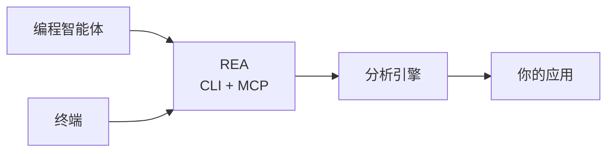

<div align="center">

[English](README.md) · **简体中文** · [日本語](README_ja.md) · [한국어](README_ko.md) · [العربية](README_ar.md)

# REA：逆向工程一切

### 一个 CLI 与 MCP 服务器，让编程智能体逆向工程任何程序

**看到喜欢的功能。理解它的原理。按照你的方式实现。**

[](https://www.npmjs.com/package/@morluto/rea)
[](https://github.com/morluto/rea/actions/workflows/ci.yml)
[](#43-个工具组成的工作台)
[](https://nodejs.org/)
[](LICENSE)

[快速开始](#快速开始) · [从二进制到行为](#从二进制到行为) · [43 个工具](#43-个工具组成的工作台) · [工作原理](#工作原理) · [常见问题](#常见问题)

<br />

<code>npx skills add morluto/rea</code>

</div>

---

看到某个应用中想加入自己产品的功能？即使没有源代码，也可以把应用交给编程智能体。借助 REA，智能体能够调查该功能、理解其工作原理，并按照你的技术栈、设计和需求构建适合你产品的版本。

REA 通过一个 CLI 与 MCP 服务器实现这套流程。智能体可以检查编译后的应用、追踪功能的工作方式，并把了解到的内容用于日常编码。REA 在一个接口背后处理复杂的逆向工程工具。

## 直接询问智能体

```bash
npx skills add morluto/rea
```

然后说：

```text
设置 REA 并逆向工程“备忘录”应用。解释搜索功能的工作方式，
说明你是如何得出结论的，然后为我的项目构建类似功能。
```

“备忘录”只是示例。你可以说出任何想了解的应用，也可以让智能体先从概览开始。

## 从二进制到行为

| 反编译                                                                       | 理解                                                                                   | 重建                                                         |
| ---------------------------------------------------------------------------- | -------------------------------------------------------------------------------------- | ------------------------------------------------------------ |
| 打开原生应用或可执行文件，恢复过程、伪代码、汇编、字符串、符号、段和元数据。 | 沿调用者、被调用者、交叉引用和调用图追踪，直到智能体能够解释功能或算法的实际工作方式。 | 将智能体学到的内容变成适合你的技术栈、界面和需求的产品功能。 |

REA 让调查始终以二进制证据为依据。它不会声称能恢复原始源代码，也不会自动克隆整个应用。

## 为什么选择 REA

|                  |                                                                |
| ---------------- | -------------------------------------------------------------- |
| **为智能体设计** | 直接询问编译后应用的行为，让智能体搜集证据，而不是猜测。       |
| **CLI 与 MCP**   | 在终端或编程智能体中使用同一套逆向工程能力。                   |
| **处理复杂流程** | REA 负责工具设置、打开应用、维持调查过程，并在完成后清理资源。 |
| **完整工作流**   | 从初步概览推进到伪代码、调用关系、类型和实现线索。             |
| **本地运行**     | 分析在你的 Mac 上运行；REA 不会把二进制上传到托管式分析服务。  |
| **保留上下文**   | 连续调查多个二进制文件，无需为每个问题重新开始整个分析过程。   |

## 快速开始

### 使用编程智能体（推荐）

```bash
npx skills add morluto/rea
```

让智能体设置 REA。它会检查你的 Mac，说明需要安装的内容，先征得同意，并引导你处理系统提示。如果智能体要求重启以加载完整工具，请在设置后重启。

### 开始之前

- macOS 12 或更高版本
- Node.js 22 或更高版本

你不需要手动安装逆向工程工具。Setup 会在需要时安装 Homebrew 和 [Hopper](https://www.hopperapp.com/)，然后配置支持的编程智能体。Hopper 是独立软件，需要单独授权；Setup 可以安装它，但不提供许可证。

```bash
# 1. 安装和配置 REA
npx -y @morluto/rea setup --yes
```

如果 macOS 或安装程序要求确认，请完成提示，然后再次运行同一命令。

### 2. 重启编程智能体

Setup 会自动配置检测到的 Claude Desktop 和 Cursor。重启应用，让它加载 REA。

### 3. 直接询问智能体

你可以直接说出应用名称。编程智能体会找到应用，并把 REA 所需的程序文件交给它。

```text
使用 REA 逆向工程“备忘录”应用。解释搜索功能的工作方式，展示证据，
然后使用 SQLite 为我的项目构建一个类似功能。
```

如果遇到问题，请运行：

```bash
npx -y @morluto/rea doctor
```

## 一个提示词，完成一次完整调查

```text
逆向工程“备忘录”应用，找到离线搜索功能的工作方式，解释其控制流，
并使用 TypeScript 和 SQLite 为我的项目构建一个版本。
```

| 步骤 | 智能体的操作           | REA 工具                                                         |
| ---: | ---------------------- | ---------------------------------------------------------------- |
|    1 | 打开并识别二进制文件   | `open_binary`, `binary_overview`                                 |
|    2 | 搜索可能的离线搜索线索 | `search_strings`, `search_procedures`, `list_names`              |
|    3 | 将线索连接到可执行代码 | `find_xrefs_to_name`, `xrefs`, `procedure_callers`               |
|    4 | 重建相关控制流         | `get_call_graph`, `procedure_callees`, `procedure_info`          |
|    5 | 反编译相关程序         | `procedure_pseudo_code`, `procedure_assembly`, `batch_decompile` |
|    6 | 在你的项目中构建该功能 | 适合你的技术栈、产品和需求的代码                                 |

REA 负责第 1–5 步中的二进制分析。第 6 步由智能体使用其常规文件编辑与测试工具完成。

## 智能体可以完成什么

- 在没有源代码时解释某项功能的实现方式。
- 重建应用的身份验证、存储、更新或网络流程。
- 恢复足够的结构，以记录未公开的格式或接口。
- 从字符串或符号追踪到实现可疑行为的代码。
- 在一个会话中切换两个应用版本并比较实现路径。
- 调查你喜欢的功能，并为自己的产品构建量身定制的版本。
- 将恢复的行为转换为产品功能、测试、迁移说明、移植代码或互操作替代品。
- 分析 Swift 和 Objective-C 元数据。
- 在 Hopper 中留下名称、注释与书签，使人与智能体的分析互相增强。

## 43 个工具组成的工作台

| 工具类别   | 数量 | 示例                                                                                                                 |
| ---------- | ---: | -------------------------------------------------------------------------------------------------------------------- |
| 二进制检查 |   31 | 过程、伪代码、汇编、字符串、名称、段、调用者、被调用者、交叉引用、注释                                               |
| 组合分析   |    9 | `binary_overview`, `analyze_function`, `batch_decompile`, `get_call_graph`, `find_xrefs_to_name`、Swift 与 ObjC 发现 |
| 二进制会话 |    3 | `open_binary`, `binary_session`, `close_binary`                                                                      |

## 与其他编程智能体一起使用

Setup 目前会自动配置 Claude Desktop 和 Cursor。任何支持本地 MCP 服务器的编程智能体都可以使用以下配置连接 REA。

```json
{
  "mcpServers": {
    "rea": {
      "command": "npx",
      "args": ["-y", "@morluto/rea", "mcp"]
    }
  }
}
```

## 工作原理



CLI 与 MCP 服务器使用相同的分析引擎。终端命令完成后会关闭应用；智能体会话则会在调查期间保持应用打开。

## CLI

上面的智能体工作流是使用 REA 最简单的方式。如果只想在终端中快速了解一个应用：

```bash
npx -y @morluto/rea analyze /Applications/Notes.app
```

运行 `npx -y @morluto/rea --help` 查看直接反编译和其他选项。

也可以全局安装 `rea` 命令：

```bash
npm install --global @morluto/rea
rea --help
rea mcp
```

REA 可以直接打开 Mac 的 `.app` 文件夹。如果智能体找不到应用，请告诉它应用安装在哪里。

## Hopper 应用行为

REA 会在需要时启动 Hopper，无需预先运行。Hopper 启动器内部会激活应用，因此打开目标时 Hopper 可能出现在其他窗口前。REA 会请求 macOS 在后台启动 Hopper，但无法保证窗口始终位于后台。

REA 会推导明确的格式和架构参数，以避免常见的 FAT 与 ARM 选择对话框。其他 Hopper 或 macOS 对话框仍可能需要人工响应。关闭 REA 会话会终止桥并删除私有套接字目录，但不会退出用户正在使用的 Hopper 应用。

## 安全模型

每个桥会话都使用随机能力令牌和仅限当前用户的 Unix 套接字。协议消息有大小限制，面向调用者的错误不会暴露启动器 stderr 或内部异常原因。

这不是沙箱，也无法防御以同一 macOS 用户身份运行的恶意进程。打开不可信二进制文件会让 Hopper 以当前用户权限进行解析和分析。请按照 [SECURITY.md](SECURITY.md) 中的私密流程报告漏洞。

## 常见问题

<details><summary><strong>Hopper 是否需要提前运行？</strong></summary>

不需要。REA 会在操作需要时启动 Hopper，也支持已经运行的 Hopper。

</details>

<details><summary><strong>REA 是否包含 Hopper？</strong></summary>

不包含。Setup 可以为你安装 Hopper，但 Hopper 仍是需要单独授权的软件。REA 提供 CLI、MCP 服务器和面向智能体的工作流。

</details>

<details><summary><strong>REA 会上传我的二进制文件吗？</strong></summary>

REA 不提供托管分析服务，而是通过本地 Unix 套接字把操作交给 Hopper。你的智能体或模型服务商可能有自己的数据政策，请单独核查。

</details>

<details><summary><strong>REA 能恢复原始源代码吗？</strong></summary>

不能保证。REA 提供伪代码、汇编、符号、字符串、元数据和关系，智能体可据此解释或兼容地重建观察到的行为。

</details>

## 开发

开发环境、架构、测试和发布说明请参阅 [CONTRIBUTING.md](CONTRIBUTING.md)。

## 许可证

[MIT](LICENSE)
