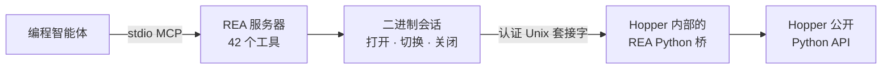

<div align="center">

[English](README.md) · **简体中文** · [日本語](README_ja.md) · [한국어](README_ko.md) · [العربية](README_ar.md)

# REA：逆向工程一切

### 一个 CLI 与 MCP 服务器，让编程智能体逆向工程任何程序

**看到喜欢的功能。理解它的原理。按照你的方式实现。**

[](https://www.npmjs.com/package/@morluto/rea)
[](https://github.com/morluto/rea/actions/workflows/ci.yml)
[](#42-个工具组成的工作台)
[](https://nodejs.org/)
[](LICENSE)

[快速开始](#快速开始) · [从二进制到行为](#从二进制到行为) · [42 个工具](#42-个工具组成的工作台) · [工作原理](#工作原理) · [常见问题](#常见问题)

<br />

<code>npx -y @morluto/rea setup --yes</code>

</div>

---

看到某个应用中想加入自己产品的功能？即使没有源代码，也可以把应用交给编程智能体。借助 REA，智能体能够调查该功能、理解其工作原理，并按照你的技术栈、设计和需求构建适合你产品的版本。

REA 通过一个 CLI 与 MCP 服务器实现这套流程。智能体可以恢复伪代码、跨函数追踪行为、检查字符串和类型，并把证据直接带入日常编码工作。REA 将逆向工程工具链、分析会话和目标生命周期统一在一个接口背后。

## 从二进制到行为

| 反编译                                                                       | 理解                                                                                   | 重建                                                         |
| ---------------------------------------------------------------------------- | -------------------------------------------------------------------------------------- | ------------------------------------------------------------ |
| 打开原生应用或可执行文件，恢复过程、伪代码、汇编、字符串、符号、段和元数据。 | 沿调用者、被调用者、交叉引用和调用图追踪，直到智能体能够解释功能或算法的实际工作方式。 | 将智能体学到的内容变成适合你的技术栈、界面和需求的产品功能。 |

REA 让调查始终以二进制证据为依据。它不会声称能恢复原始源代码，也不会自动克隆整个应用。

## 为什么选择 REA

|                  |                                                                |
| ---------------- | -------------------------------------------------------------- |
| **为智能体设计** | 直接询问编译后应用的行为，让智能体搜集证据，而不是猜测。       |
| **CLI 与 MCP**   | 在终端或编程智能体中使用同一套逆向工程能力。                   |
| **处理复杂流程** | REA 负责工具设置、打开应用、维持调查过程，并在完成后清理资源。 |
| **完整工作流**   | 从初步概览推进到伪代码、调用关系、类型和实现线索。             |
| **本地运行**     | 分析在你的 Mac 上运行；REA 不会把二进制上传到托管式分析服务。  |
| **保留上下文**   | 连续调查多个二进制文件，无需为每个问题重新开始整个分析过程。   |

## 快速开始

### 环境要求

- macOS 12 或更高版本
- Node.js 22 或更高版本
- [Hopper Disassembler](https://www.hopperapp.com/)

REA 不捆绑 Hopper。Setup 可以在需要时安装 Homebrew 和 `hopper-disassembler` cask，配置检测到的 Claude Desktop 与 Cursor MCP 客户端，并安装 REA 智能体技能。现有客户端配置会先备份，再原子写入并进行语义回读验证。

```bash
# 1. 安装和配置
npx -y @morluto/rea setup --yes

# 2. 检查集成
npx -y @morluto/rea doctor

# 3. 启动 stdio MCP 服务器
npx -y @morluto/rea mcp
```

MCP 命令通过 stdio 通信，因此会静默等待客户端连接。如果 setup 已检测并配置你的客户端，请重启客户端并使用已注册的 `rea` 服务器。

然后可以这样询问智能体：

```text
打开 /path/to/MyApp，概述该二进制文件，找到身份验证流程，
反编译相关过程，并展示支持结论的证据。
```

## 一个提示词，完成一次完整调查

```text
打开 MyApp，找到离线搜索功能的工作方式，解释其控制流，
并使用 TypeScript 和 SQLite 为我的项目构建一个版本。
```

| 步骤 | 智能体的操作           | REA 工具                                                         |
| ---: | ---------------------- | ---------------------------------------------------------------- |
|    1 | 打开并识别二进制文件   | `open_binary`, `binary_overview`                                 |
|    2 | 搜索可能的离线搜索线索 | `search_strings`, `search_procedures`, `list_names`              |
|    3 | 将线索连接到可执行代码 | `find_xrefs_to_name`, `xrefs`, `procedure_callers`               |
|    4 | 重建相关控制流         | `get_call_graph`, `procedure_callees`, `procedure_info`          |
|    5 | 恢复实现               | `procedure_pseudo_code`, `procedure_assembly`, `batch_decompile` |
|    6 | 在你的项目中构建该功能 | 适合你的技术栈、产品和需求的代码                                 |

REA 负责第 1–5 步中的二进制分析。第 6 步由智能体使用其常规文件编辑与测试工具完成。

## 智能体可以完成什么

- 在没有源代码时解释某项功能的实现方式。
- 重建应用的身份验证、存储、更新或网络流程。
- 恢复足够的结构，以记录未公开的格式或接口。
- 从字符串或符号追踪到实现可疑行为的代码。
- 在一个会话中切换两个应用版本并比较实现路径。
- 调查你喜欢的功能，并为自己的产品构建量身定制的版本。
- 将恢复的行为转换为产品功能、测试、迁移说明、移植代码或互操作替代品。
- 分析 Swift 和 Objective-C 元数据。
- 在 Hopper 中留下名称、注释与书签，使人与智能体的分析互相增强。

## 42 个工具组成的工作台

| 工具类别   | 数量 | 示例                                                                                             |
| ---------- | ---: | ------------------------------------------------------------------------------------------------ |
| 二进制检查 |   31 | 过程、伪代码、汇编、字符串、名称、段、调用者、被调用者、交叉引用、注释                           |
| 组合分析   |    8 | `binary_overview`, `batch_decompile`, `get_call_graph`, `find_xrefs_to_name`、Swift 与 ObjC 发现 |
| 二进制会话 |    3 | `open_binary`, `binary_session`, `close_binary`                                                  |

公开工具清单通过契约测试和隔离的打包 MCP 客户端验证。真实 Hopper 验证还会使用两个二进制文件检查同一套 42 工具接口。

## MCP 工作流

1. 使用 `open_binary` 打开可读的本地二进制文件或 `.hop` 路径。
2. 从 `binary_overview` 开始，再通过字符串、符号、反编译、调用者、被调用者和交叉引用缩小范围。
3. 再次调用 `open_binary` 切换目标；如果新目标失败，REA 会尝试重新打开之前的目标。
4. 完成后调用 `close_binary`。`binary_session` 可随时报告当前状态。

REA 自动识别 Mach-O/FAT、ELF、PE 和 Hopper 数据库。相对路径以 MCP 服务器工作目录为基准；FAT 二进制会自动选择与宿主兼容的架构。

### 手动 MCP 配置

```json
{
  "mcpServers": {
    "rea": {
      "command": "npx",
      "args": ["-y", "@morluto/rea", "mcp"]
    }
  }
}
```

## 工作原理



CLI 与 MCP 适配器直接调用同一套二进制会话和分析运行时，二者不会互相调用。一次性命令会为每次操作获取并关闭资源；MCP 模式则在多次调用和目标切换之间保持会话。

## CLI

```bash
npx -y @morluto/rea --help
npx -y @morluto/rea doctor --target /path/to/binary
npx -y @morluto/rea analyze /path/to/binary
npx -y @morluto/rea decompile /path/to/binary 0x100003f20
```

也可以全局安装 `rea` 命令：

```bash
npm install --global @morluto/rea
rea --help
rea mcp
```

## Hopper 应用行为

REA 会在需要时启动 Hopper，无需预先运行。Hopper 启动器内部会激活应用，因此打开目标时 Hopper 可能出现在其他窗口前。REA 会请求 macOS 在后台启动 Hopper，但无法保证窗口始终位于后台。

REA 会推导明确的格式和架构参数，以避免常见的 FAT 与 ARM 选择对话框。其他 Hopper 或 macOS 对话框仍可能需要人工响应。关闭 REA 会话会终止桥并删除私有套接字目录，但不会退出用户正在使用的 Hopper 应用。

## 安全模型

每个桥会话都使用随机能力令牌和仅限当前用户的 Unix 套接字。协议消息有大小限制，面向调用者的错误不会暴露启动器 stderr 或内部异常原因。

这不是沙箱，也无法防御以同一 macOS 用户身份运行的恶意进程。打开不可信二进制文件会让 Hopper 以当前用户权限进行解析和分析。请按照 [SECURITY.md](SECURITY.md) 中的私密流程报告漏洞。

## 常见问题

<details><summary><strong>Hopper 是否需要提前运行？</strong></summary>

不需要。REA 会在操作需要时启动 Hopper，也支持已经运行的 Hopper。

</details>

<details><summary><strong>REA 是否包含 Hopper？</strong></summary>

不包含。Hopper 是独立安装和授权的软件。REA 提供 CLI、MCP 服务器、会话管理、分析工作流和认证桥。

</details>

<details><summary><strong>REA 会上传我的二进制文件吗？</strong></summary>

REA 不提供托管分析服务，而是通过本地 Unix 套接字把操作交给 Hopper。你的智能体或模型服务商可能有自己的数据政策，请单独核查。

</details>

<details><summary><strong>REA 能恢复原始源代码吗？</strong></summary>

不能保证。REA 提供伪代码、汇编、符号、字符串、元数据和关系，智能体可据此解释或兼容地重建观察到的行为。

</details>

## 开发

```bash
npm ci
npm run check
npm run verify:package
npm pack --dry-run
```

真实 Hopper 验证需要两个不同的二进制文件：

```bash
HOPPER_TARGET_PATH=/path/to/target-a \
HOPPER_SECOND_TARGET_PATH=/path/to/distinct-target-b \
npm run verify:hopper
```

架构规范、Pull Request 要求与维护者发布清单请参阅 [CONTRIBUTING.md](CONTRIBUTING.md)。

## 许可证

[MIT](LICENSE)
