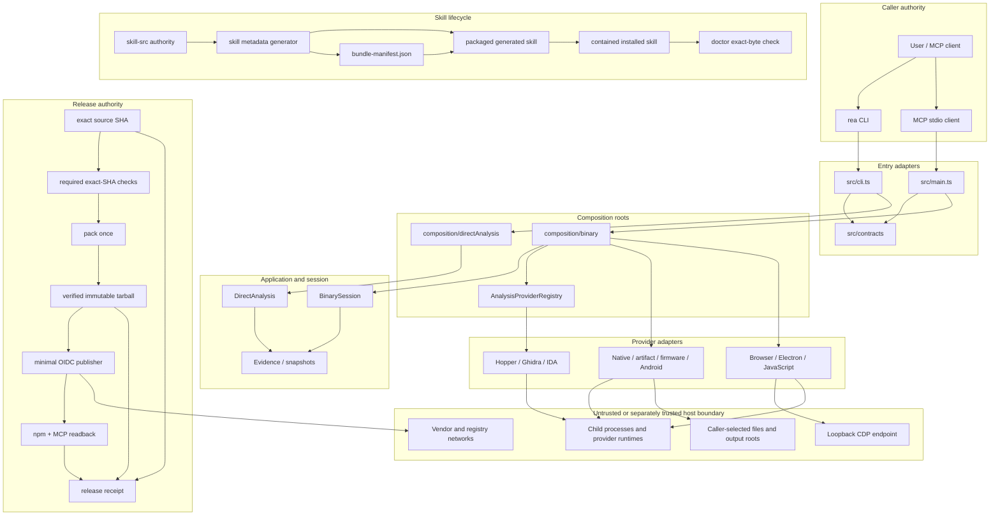

# Production-readiness architecture

This document extends [`architecture.mermaid`](architecture.mermaid) with the
security, generated-artifact, skill, CI, and release boundaries required for a
production REA lifecycle. It separates **implemented controls** from
**release-blocking decisions**.

## System and authority map



## Dependency rules

| Layer                | May depend on                                                    | Must not depend on                                         |
| -------------------- | ---------------------------------------------------------------- | ---------------------------------------------------------- |
| Domain and contracts | standard library, pure schemas and values                        | composition roots, concrete providers, process launchers   |
| Application          | domain/contracts and narrow provider ports                       | concrete provider construction, transport-specific state   |
| Composition          | application ports and concrete providers                         | caller UI behavior or generated package state              |
| Entry adapters       | contracts, application workflows, composition factories          | provider internals                                         |
| Providers            | domain/contracts, bounded process/filesystem/network foundations | CLI/MCP registration                                       |
| Generated artifacts  | declared source authority and deterministic generators           | hand-edited generated output                               |
| Release              | exact source/check/artifact identities                           | mutable action tags, rebuild-on-publish, implicit defaults |

The existing module-boundary verifier enforces part of this matrix. A complete
allow-list remains follow-up work; exceptions should cite an ADR.

## Trust boundaries and mandatory controls

| Boundary                  | Input is treated as                     | Required controls                                                          | Current state                                                                                                                                          |
| ------------------------- | --------------------------------------- | -------------------------------------------------------------------------- | ------------------------------------------------------------------------------------------------------------------------------------------------------ |
| MCP caller to contracts   | untrusted structured data               | schema, size/depth limits, truthful effects, cancellation                  | implemented broadly; process-execution default policy pending                                                                                          |
| Provider process output   | untrusted bytes                         | byte/time limits, typed overflow, complete owned-tree cleanup              | native cap implemented; universal supervisor default pending                                                                                           |
| Loopback CDP              | untrusted local service                 | literal loopback, deadline, response/target/string limits                  | loopback and response-byte cap implemented; full deadline/string policy pending                                                                        |
| Filesystem install/output | mutable and symlinkable                 | canonical containment, no-follow semantics, atomic writes, digest readback | preflight symlink rejection, per-file atomic writes, and digests implemented; race-free containment pending                                            |
| Vendor installer          | network-controlled artifact             | independent digest/signing identity and explicit execution approval        | Linux pinned; macOS trust-root hardening pending                                                                                                       |
| CI third-party code       | supply-chain dependency                 | full-SHA pins, least privilege, timeouts                                   | full-SHA pins implemented; remaining workflow policy pending                                                                                           |
| Package publication       | privileged irreversible operation       | exact-SHA checks, pack once, isolated publisher, registry readback         | exact retained-tarball publication implemented in the privileged job; isolated build/publisher, exact-SHA authorization, and registry readback pending |
| Generated skill           | package-controlled operational guidance | one manifest, file digests, version identity, exact-byte doctor            | manifest and byte authority implemented; version-bump policy pending                                                                                   |

## Runtime lifecycle

```text
startup
  -> parse and validate immutable configuration
  -> construct logger, providers, session, server and transport once
  -> admit bounded operations
  -> stop admission on EOF or signal
  -> cancel active operations
  -> bounded transport/session/provider cleanup
  -> verify owned-process cleanup
  -> exit success or explicit incomplete-cleanup status
```

The immutable-configuration and bounded-shutdown behavior is proposed in
ADR-0007 and is not yet shipped. Until it is implemented, configuration changes
require a controlled restart and lifecycle readiness remains on hold.

## Skill lifecycle

```text
authored skill-src tree
  -> strict validation
  -> deterministic generated projection
  -> sorted bundle manifest with per-file SHA-256
  -> completion-ledger directory digest
  -> npm tarball inclusion and verification
  -> preflight-checked setup with per-file atomic replacement
  -> exact-byte doctor verification
  -> whole-root uninstall / manifest-driven upgrade
  -> release-gated agent evaluation
```

The manifest, digest checks, static symlink rejection, and per-file atomic
replacement are implemented. Descriptor-bound containment, bundle-wide crash
consistency, strict frontmatter and tool-reference validation, managed-residue
cleanup, version-bump enforcement, and release-gated comparative model
evaluation remain open. Uninstall currently owns and removes the complete
canonical skill root, including operator-added files inside that root.

## Release lifecycle

```text
frozen source SHA
  -> required exact-SHA CI/provider evidence
  -> unprivileged build
  -> pack once
  -> verify exact tarball + manifest + skill lifecycle
  -> immutable artifact handoff
  -> minimal OIDC publish job
  -> npm integrity/provenance readback
  -> MCP Registry identity readback
  -> retained release receipt
```

All Actions are full-SHA pinned. The remainder of this lifecycle is an accepted
architecture decision but not yet fully implemented; no release should be
represented as production-authorized until ADR-0006 hold conditions are closed.

## Readiness status

### Implemented in the production-readiness branch

- Native command output budget and typed `output-limit` failure.
- CDP discovery response-byte budget.
- Destructive annotation for caller-selected process execution.
- Preflight rejection of observed symlinks in the managed skill path.
- Generated skill bundle manifest with per-file SHA-256.
- Manifest-driven setup and completion-ledger commitment.
- Full-SHA GitHub Action references and a policy regression test.

### Release blockers

- Default-disabled policy and independent approval for arbitrary process capture.
- Universal subprocess limits and scrubbed environments.
- macOS Hopper independent authenticity root.
- Immutable startup configuration and bounded shutdown.
- Exact Node/npm enforcement in every workflow.
- Exact-SHA required-check and provider-lane closure.
- Pack-once exact-artifact publication with an unprivileged build boundary.
- npm and MCP Registry readback plus consolidated release receipt.
- Protected `release/*` ruleset verified from GitHub.
- Release-gated skill compatibility and comparative agent evaluation.
- Descriptor-bound/no-follow skill installation and bundle-wide transactions.
